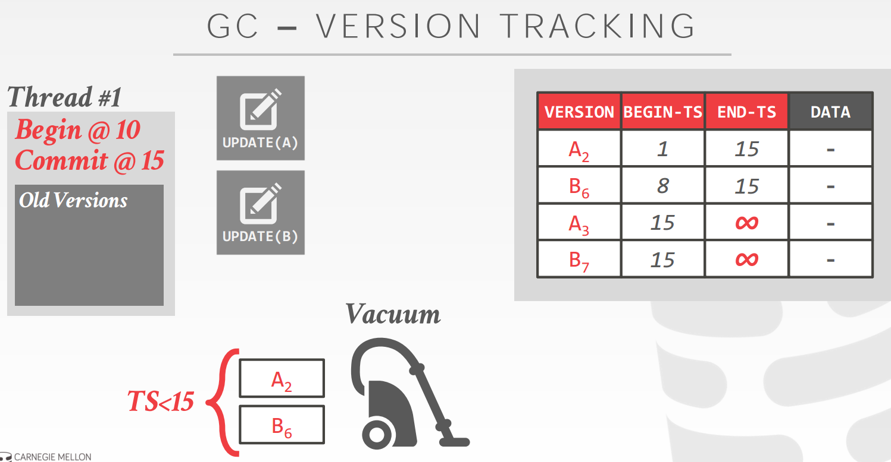

# [CMU 15-721 Advanced Database Systems (Spring 2019)](https://www.youtube.com/playlist?list=PLSE8ODhjZXja7K1hjZ01UTVDnGQdx5v5U)

课程配套的 notes 很全，配套论文阅读：[Schedule - CMU 15-721 Advanced Database Systems (Spring 2019)](https://15721.courses.cs.cmu.edu/spring2019/schedule.html)

- [01 In-Memory Databases](#01)
- [02 Transaction Models & In-Memory Concurrency Control](#02)
- [03 Multi-Version Concurrency Control Design Decisions](#03)
- [04 Multi-Version Concurrency Control Protocols](#04)
- [05 MVCC Garbage Collection](#05)
- 
- [09 Storage Models & Data Layout](#09)
- 

&nbsp;   

## 01 In-Memory Databases

没有 I/O 影响之后的瓶颈：

- concurrency control
  - Disk oriented DB 额外维护 lock/latch table
  - In memory DB 把 lock 和 tuple 放一起
- cache line miss
- pointer chasing (indirect layer)
- predicate evaluation：where clause（compilation）
- data copy
- logging and recovery

### Data Organization

DB 自己管理 eviction/flush and cache policy

&nbsp;   

## 02 Transaction Models & In-Memory Concurrency Control

&nbsp;   

## 03 Multi-Version Concurrency Control Design Decisions

SI：read the ***consistent*** snapshot that has been commited before te txn starts

**大量操作基于 CAS**

- `TXN-ID` 表示写锁，哪个 txn 正在占用
- 读操作不阻塞，只 CAS upadte `READ-TS`

- `TXN-ID` 表示写锁，`READ-CNT` 表示读锁。这两个都是 32bit，共同组成一个 64bit，一起做 CAS

### Version Storage

- 如果 head 是 oldest，那么每次写都会遍历 version chain，head 索引是固定的
- 如果 head 是 newest，写操作不遍历 version chain，但是会 update 所有 head 的索引

- main table 是 newest，写前把旧的 copy 到 time travel table

- 只记录被修改的 column，省空间
- reconstruct 需要回溯

### GC

#### Tuple level GC

#### Transaction level GC

记录 read/write set

### Index Management

### Design Decision

&nbsp;   

## 04 Multi-Version Concurrency Control Protocols

- txn 有两个 ts：begin-ts 和 commit-ts
- `txn@ts` 表示 txn 还未提交，但是 begin-ts 是 ts
- 先写入新的 tuple (begin-ts, infinity)
- 然后把上一个指针指向这个 tuple（CAS，这里失败说明 first-writer-wins）
- ！！！这时候这个 tuple 还是不可见！！！
- 将上一个 end-ts 写成 begin-ts
- 获取 commit-ts
- 更新上一个 end-ts 和这个 begin-ts

为了支持 repeatable read 甚至 serializability，维护一些 metadata：

### commit

- Optimistic
  - 检查 version read 仍然可见
  - 检查所有 scan 是否有 phantom
- Pessimistic
  - 读写锁
  - 不需要 validation
  - detect deadlock

有一个挺不错的优化（针对 delta storage）：Precision Locking

- 检查 validation phase 的 read sets 是否 phantom，即对于那些在 start-ts 之后 commit 的 txn 的 write sets
- 只保留 read predicate

还有很多优化和 trade-off，太细了，不写了。

&nbsp;   

## 05 MVCC Garbage Collection

### Index

维护 index 到 version table：**一个 pk 对多个 version**

### Version tracking - Txn level

对于一个 write txn，记录下被修改的 tuple 之前的 older version 指针，在成功 commit 后交给 background vacuum。（当然部分 older version 可能还在被 read）

### Comparison

简单的做法是回收比当前最小 txn-ts 还小的 version；更细致的方法是比较 version 的 interval 是否 visible

### Physical Memory Collection

- 变长数据：reuse
- 定长数据
  - reuse：降低了 temporal locality，old 和 new 混在一起（对于 append storage 无所谓；delta storage 缓存不友好）
  - no reuse：compaction

&nbsp;   

##

&nbsp;   

##

&nbsp;   

##

&nbsp;   

##  09 Storage Models & Data Layout

### Data Presentation

- 每个 tuple 定长 block，变长数据用指针指向 variable length pool
- 处理 `NULL`
  - column bitmap（业界常用做法）
  - 存在 tuple 中，每个 attribute 一个 NULL flag（我写xjbDB的时候是打算这样做的，问题：alignment）
- attribute 分布
  - padding
  - reorder

### Storage Model

- N-ary Storage Model (NSM)
- Decomposition Storage Model (DSM)
- Hybrid Storage Model

#### NSM

- OLTP - insert/update/delete
- 如果只需要一列，cache 不友好

#### DSM

- 固定 offset
- compression

#### Hybrid Storage Model

- 新数据频繁 txn，使用 row-store
- 旧数据基本只有 analytical query

结合两种引擎

- Fractured Mirror
  - 内存中复制一个 DSM
  - OLTP txn 由后台线程在 DSM 中执行
  - OLAP 在 DSM 中执行
  - 需要维护 synchronization
- Delta Store
  - 把旧数据移到 DSM，新数据在 NSM（类似 MVCC 的 delta version 中的 main table 和 delta table）
  - （没搞懂这样怎么做 OLAP）

&nbsp;   

##

&nbsp;   

##

&nbsp;   

##
