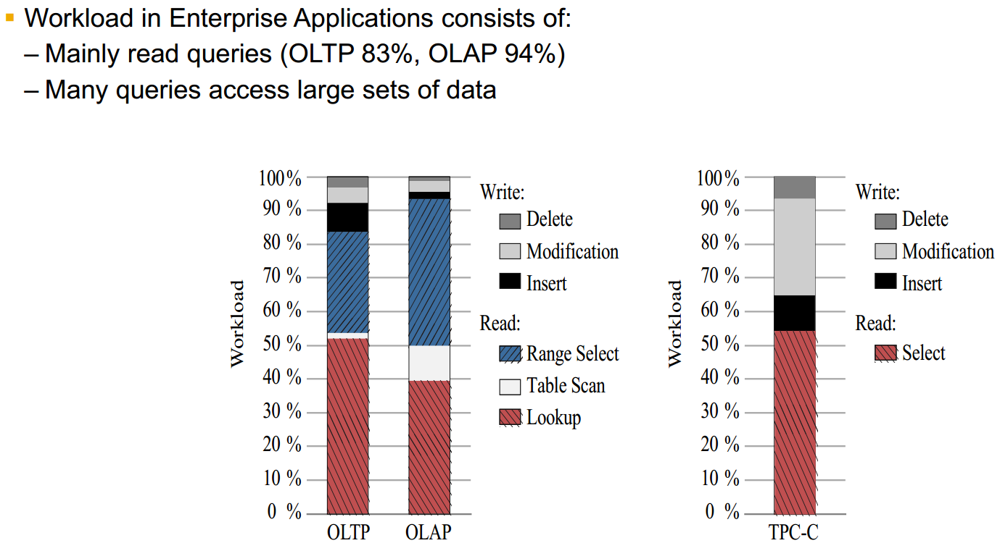

# [CMU 15-721 Advanced Database Systems (Spring 2019)](https://www.youtube.com/playlist?list=PLSE8ODhjZXja7K1hjZ01UTVDnGQdx5v5U)

课程配套的 notes 很全，配套论文阅读：[Schedule - CMU 15-721 Advanced Database Systems (Spring 2019)](https://15721.courses.cs.cmu.edu/spring2019/schedule.html)

- [01 In-Memory Databases](#01)
- [02 Transaction Models & In-Memory Concurrency Control](#02)
- [03 Multi-Version Concurrency Control Design Decisions](#03)
- [04 Multi-Version Concurrency Control Protocols](#04)
- [05 MVCC Garbage Collection](#05)
- [06 Index Locking & Latching](#06)
- [07 OLTP Indexes: Latch-free Data Structures](#07)
- [08 OLTP Indexes: Trie Data Structures](#08)
- [09 Storage Models & Data Layout](#09)
- [10 Database Compression](#10)
- [11 Larger-than-Memory Databases](#11)
- [12 Recovery Protocols](#12)
- [13 Networking Protocols](#13)
- [14 Scheduling](#14)
- 
- [25 Self-Driving Databases](#25)
- [26 Anil Goel (SAP HANA)](#26)

&nbsp;   

## 01 In-Memory Databases

没有 I/O 影响之后的瓶颈：

- concurrency control
  - Disk oriented DB 额外维护 lock/latch table
  - In memory DB 把 lock 和 tuple 放一起
- cache line miss
- pointer chasing (indirect layer)
- predicate evaluation：where clause（compilation）
- data copy
- logging and recovery

### Data Organization

DB 自己管理 eviction/flush and cache policy

&nbsp;   

## 02 Transaction Models & In-Memory Concurrency Control

&nbsp;   

## 03 Multi-Version Concurrency Control Design Decisions

SI：read the ***consistent*** snapshot that has been commited before te txn starts

**大量操作基于 CAS**

- `TXN-ID` 表示写锁，哪个 txn 正在占用
- 读操作不阻塞，只 CAS upadte `READ-TS`

- `TXN-ID` 表示写锁，`READ-CNT` 表示读锁。这两个都是 32bit，共同组成一个 64bit，一起做 CAS

### Version Storage

- 如果 head 是 oldest，那么每次写都会遍历 version chain，head 索引是固定的
- 如果 head 是 newest，写操作不遍历 version chain，但是会 update 所有 head 的索引

- main table 是 newest，写前把旧的 copy 到 time travel table

- 只记录被修改的 column，省空间
- reconstruct 需要回溯

### GC

#### Tuple level GC

#### Transaction level GC

记录 read/write set

### Index Management

### Design Decision

&nbsp;   

## 04 Multi-Version Concurrency Control Protocols

- txn 有两个 ts：begin-ts 和 commit-ts
- `txn@ts` 表示 txn 还未提交，但是 begin-ts 是 ts
- 先写入新的 tuple (begin-ts, infinity)
- 然后把上一个指针指向这个 tuple（CAS，这里失败说明 first-writer-wins）
- ！！！这时候这个 tuple 还是不可见！！！
- 将上一个 end-ts 写成 begin-ts
- 获取 commit-ts
- 更新上一个 end-ts 和这个 begin-ts

为了支持 repeatable read 甚至 serializability，维护一些 metadata：

### commit

- Optimistic
  - 检查 version read 仍然可见
  - 检查所有 scan 是否有 phantom
- Pessimistic
  - 读写锁
  - 不需要 validation
  - detect deadlock

有一个挺不错的优化（针对 delta storage）：Precision Locking

- 检查 validation phase 的 read sets 是否 phantom，即对于那些在 start-ts 之后 commit 的 txn 的 write sets
- 只保留 read predicate

还有很多优化和 trade-off，太细了，不写了。

&nbsp;   

## 05 MVCC Garbage Collection

### Index

维护 index 到 version table：**一个 pk 对多个 version**

### Version tracking - Txn level

对于一个 write txn，记录下被修改的 tuple 之前的 older version 指针，在成功 commit 后交给 background vacuum。（当然部分 older version 可能还在被 read）

### Comparison

简单的做法是回收比当前最小 txn-ts 还小的 version；更细致的方法是比较 version 的 interval 是否 visible

### Physical Memory Collection

- 变长数据：reuse
- 定长数据
  - reuse：降低了 temporal locality，old 和 new 混在一起（对于 append storage 无所谓；delta storage 缓存不友好）
  - no reuse：compaction

&nbsp;   

## 06 Index Locking & Latching

> 我写存储引擎之前应该来看这节课的。。。

index：DB 维护的用于加速数据检索的数据结构。有 B树 和 hash 两种。通常使用 B树，为了 range query

- lock：逻辑上的，txn duration
- latch：底层细节，mutex

- `std::mutex`：不要用
- `std::atomic<T>`：spinlock，最好避免空等或os把正在做事的线程调度了
- `std::atomic<Latch*>`：原子链表
- 读写锁，使用 spinlock 实现

**B+树上的锁只是保证 physical data structure，需要逻辑上的 lock 来保证 txn isolation level**

### Lock

- 持有周期是 txn level
- lock 并不在 node 上，而是单独的结构来管理

#### Lock Schemas

- Predicate Locks
  - 逻辑上检测 query 是否 intersect
  - 难以实现
- Key-Value Locks
  - 难以管理 key，并发请求的 notification 机制，key 的 gc
- Gap Locks
- Key-Range Locks
- Hierarchical Locking

&nbsp;   

## 07 OLTP Indexes: Latch-free Data Structures

### Skip List

- 不能 reverse access
- 不要用跳表！！

### Bw-Tree

有点像 B+-Tree 结合了 LSM-Tree，但细节是在太多了，爆炸。。。

&nbsp;   

## 08 OLTP Indexes: Trie Data Structures

### Index GC

使用 ref count，但是会 suffer cache coherence，我们只关心是否为0，而不是具体值。

维护一个 epoch，标记一段时间，当一个 epoch 中的 thread 全部离开时，开始回收。

### Non Unique Key

由于 MVCC 不同 snapshot 的 version 不一样，一个 key 可能对应多个 version（*感觉实现起来有很多坑，暂时还没有想通*）

### Variable Length Key

做工程就要面对这些很多肮脏的细节，，爆炸。。

key 存储 offset，content 从 page 最后依次放置。要考虑一些 overflow 引发的 indirect concatenate。还可以 compression。

### Judy Array (Tire)

由于 string 对于 + 是 associative，可以把 string 拆开

处理 branch 过多的方法：

- linear：只保留固定位置
- bitmap：记录哪些地方有，把有的 branch 压缩在一起（没讲怎么处理 insert/delete）
- 所有 branch 都留位置

### ART (Adaptive Radix Tree)

另一种 branch 压缩方法

处理 concurrenct access

- Optimistic Lock Coupling
  - writer 不会被 reader 阻塞（*有点诡异*）
  - 在 node 上加标记，比如递增的 version nmber
  - writer 每次拿锁，并且增加 version number
  - reader 等锁，直接往下走，每次向上检查一个 node，version number 是否被修改过。如果被修改，那么重来
  - Epoch GC
- Read-Optimized Write Exclusion
  - writer 保证 reader consistent

### MASSTREE

&nbsp;   

##  09 Storage Models & Data Layout

### Data Presentation

- 每个 tuple 定长 block，变长数据用指针指向 variable length pool
- 处理 `NULL`
  - column bitmap（业界常用做法）
  - 存在 tuple 中，每个 attribute 一个 NULL flag（我写xjbDB的时候是打算这样做的，问题：alignment）
- attribute 分布
  - padding
  - reorder

### Storage Model

- N-ary Storage Model (NSM)
- Decomposition Storage Model (DSM)
- Hybrid Storage Model

#### NSM

- OLTP - insert/update/delete
- 如果只需要一列，cache 不友好

#### DSM

- 固定 offset
- compression

#### Hybrid Storage Model

- 新数据频繁 txn，使用 row-store
- 旧数据基本只有 analytical query

结合两种引擎

- Fractured Mirror
  - 内存中复制一个 DSM
  - OLTP txn 由后台线程在 DSM 中执行
  - OLAP 在 DSM 中执行
  - 需要维护 synchronization
- Delta Store
  - 把旧数据移到 DSM，新数据在 NSM（类似 MVCC 的 delta version 中的 main table 和 delta table）
  - （没搞懂这样怎么做 OLAP）

&nbsp;   

## 10 Database Compression

目的是 performance，最好可以在 encoded 情况下进行 OLAP

### columnar compression

trade-off，data pattern

&nbsp;   

## 11 Larger-than-Memory Databases

&nbsp;   

## 12 Recovery Protocols

### Logging Scheme

- physical：byte-level
- logical：记录 txn 的逻辑动作（update, insert, delete）

log record format：

- txn id
- 若干三元组
  - table
  - key
  - value list
      - attribute+value

> 还是没太搞懂 concurrent txn 怎么 log

### Recovery Protocol

- load checkpoint，恢复 index
- replay redo-log

### Checkpoint

> 感觉还是 mvcc 好

&nbsp;   

## 13 Networking Protocols

### Bypass Kernel

- Remote Direct Memory Access

&nbsp;   

## 14 Scheduling

### process model

#### process per worker
- OS 负责调度
- IPC, shared memory for glocal data structure
- 例如：IBM DB2, Postgres, Oracle
- 原因是当时没有 POSIX Thread

#### thread per worker

- DBMS 负责调度
- synchronization
- 例如：IBM DB2, Mysql, Oracle

给 worker 分配 task 时考虑 NUMA

### data placement

### scheduling

#### Hyper 

- morsel-based
- numa-aware operator

stealing work 一般针对 core 数量不多，否则性能下降，因为 interconnect。主要对于 cpu intensive workload 可以 steal

#### HANA

- soft work 可以被 steal，hard work 不行
- 一些 working threading 轮询 soft queue 执行，hard queue 中的任务由 watch-dog 找对应的 core 来执行

&nbsp;   

## 

&nbsp;   

## 25 Self-Driving Databases

对于 replicated server，考虑转发读请求（影响对 index 的 evaluation），以及底层 hardware 不同

&nbsp;   

## 26 Anil Goel (SAP HANA)

问题：晚上迁移数据，OLTP引擎→OLAP引擎，不能及时做 analytical query；此外有额外的开销

HANA：不错的 OLTP 引擎 + 及时的 OLAP 支持

- Row Store：小部分热数据（叫做 delta store）
  - B+Tree 只用于这部分数据
- Column Store：Read-Optimized, Immutable Data Store（叫做 main）
  - 读操作同时访问 delta store 和 main，得到 multiversion。这里的 index 是 Hash
  - dictionary compreesion
      - 前缀压缩
      - 字典映射值与数据顺序相同（因为 main 是不变的，否则需要不断 recode）
  - 如果想对 column storage 做 OLTP txn（列粒度）
      - 只允许做 delete，用 bitmap 标记
      - 如果是 update，看作 delete，然后 insert 到 delta store
  - delta store 隔一段时间要 merge 到 main store

memory buffer 管理

