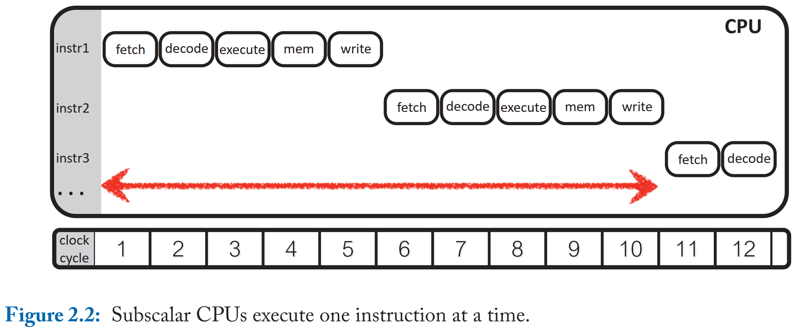
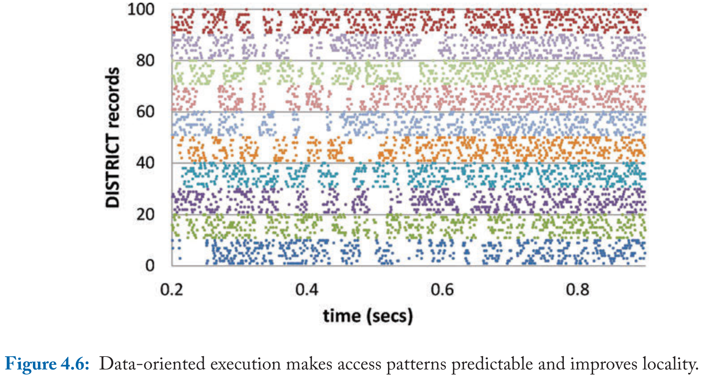

# Databases on Modern Hardware - How to Stop Underutilization and Love Multicores 读书笔记

- [1 Introduction](#1)
- [PART I Implicit/Vertical Scalability]
  - [2 Exploiting Resources of a Processor Core](#2)
  - [3 Minimizing Memory Stalls](#3)
- [PART II Explicit/Horizontal Scalability]
  - [4 Scaling-up OLTP](#4)
  - [5 Scaling-up OLAP Workloads](#5)
- [PART III Conclusions]
  - [6 Outlook](#6)
  - [7 Summary](#7)

&nbsp;   

## 1 Introduction

### 1.1 IMPLICIT/VERTICAL DIMENSION

- **充分压榨单核性能**（同时受限于散热）
- aggressive microarchitectural features
- instruction/data level parallelism
- memory hierarchy (memory stall, data intensive workloads)
- instruction: compiler optimization, prefetching, computation spreading, txn batching
- data: cache-conscious, partitioning, thread scheduling

### 1.2 EXPLICIT/HORIZONTAL DIMENSION

- **充分利用多核扩展性**（同时受限于核间通信）
- socket communication, shared LLC, NUMA, interconnect bandwidth
- TP: 挑战在于 communication，本文提出 unbounded/fixed/cooperative 尽可能降低 communication
- AP: latency, bandwidth, NU shared everything, topology-aware
  - across-core scheduling：减少 across-core access
  - data placement：减少 latency
  - 这两者互相影响

### 1.3 STRUCTURE OF THE BOOK

- 传统执行模型怎么充分利用硬件
- 最大化利用 data/instr locality
- 在 NU 场景下怎么 scale-up

&nbsp;   

## 2 Exploiting Resources of a Processor Core

&nbsp;   

## 3 Minimizing Memory Stalls

&nbsp;   

## 4 Scaling-up OLTP

&nbsp;   

## 5 Scaling-up OLAP Workloads

&nbsp;   

## 6 Outlook

&nbsp;   

## 7 Summary

