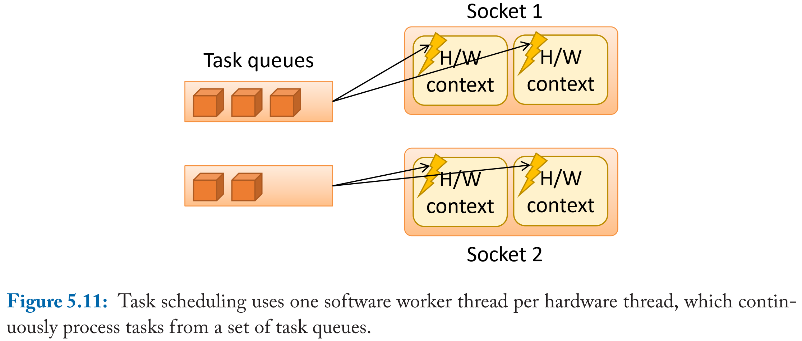
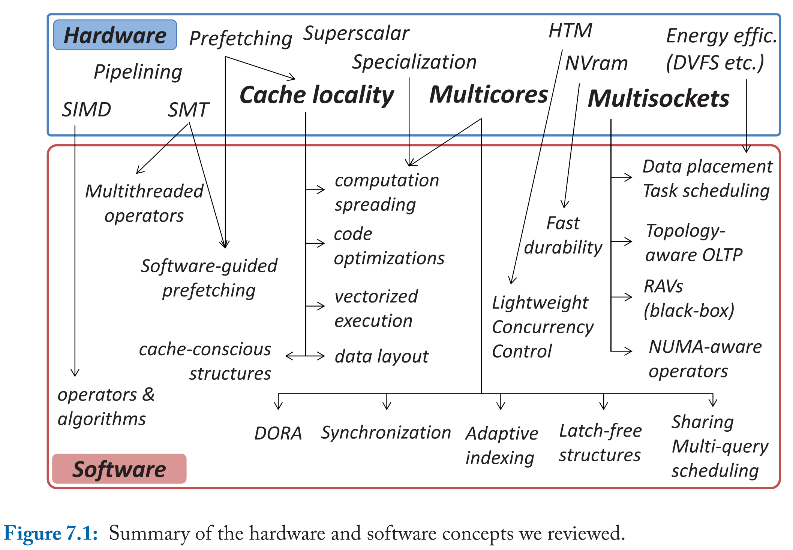

# Databases on Modern Hardware - How to Stop Underutilization and Love Multicores 读书笔记

- [1 Introduction](#1)
- [PART I Implicit/Vertical Scalability]
  - [2 Exploiting Resources of a Processor Core](#2)
    - Instruction and Data Parallelism
    - Multithreading
    - Horizontal Parallelism
  - [3 Minimizing Memory Stalls](#3)
    - Workload Characterization for Typical Data Management Workloads
    - Prefetching
    - Being Cache-conscious while Writing Software
    - Exploiting Common Instructions
- [PART II Explicit/Horizontal Scalability]
  - [4 Scaling-up OLTP](#4)
    - Focus on Unscalable Components: Locking, Latching, Logging, Synchronization
    - Non-uniform Communication
  - [5 Scaling-up OLAP Workloads](#5)
    - Sharing Across Concurrent Queries: Reactive, Proactive
    - NUMA-awareness
      - Analytical Operators
      - Task Scheduling
      - Coordinated Data Placement and Task Scheduling
- [PART III Conclusions]
  - [6 Outlook](#6)
  - [7 Summary](#7)


&nbsp;   
<a id="1"></a>
## 1 Introduction

### 1.1 Implicit/Vertical Dimension


- **充分压榨单核性能**（同时受限于散热）
- aggressive microarchitectural features
- instruction/data level parallelism
- memory hierarchy (memory stall, data intensive workloads)
- instruction: compiler optimization, prefetching, computation spreading, txn batching
- data: cache-conscious, partitioning, thread scheduling

### 1.2 Explicit/Horizontal Dimension


- **充分利用多核扩展性**（同时受限于核间通信）
- socket communication, shared LLC, NUMA, interconnect bandwidth
- TP: 挑战在于 communication，本文提出 unbounded/fixed/cooperative 尽可能降低 communication
- AP: latency, bandwidth, NU shared everything, topology-aware
  - across-core scheduling：减少 across-core access
  - data placement：减少 latency
  - 这两者互相影响

### 1.3 Structure of the Book

- 传统执行模型怎么充分利用硬件
- 最大化利用 data/instr locality
- 在 NU 场景下怎么 scale-up


&nbsp;   
<a id="2"></a>
## 2 Exploiting Resources of a Processor Core


### 2.1 Instruction and Data Parallelism


- cpu pipeline: [Processor Microarchitecture an Implementation Perspective 读书笔记](https://github.com/rsy56640/Computer_Architecture_learning/tree/master/Processor%20Microarchitecture%20An%20Implementation%20Perspective%20%E7%AC%94%E8%AE%B0)
- 串行，pipeline，superscalar（同时发射多条指令）


### 2.2 Multithreading


- microarchitectural 资源分割（issue queue, ROB, load/store buffer），对于计算密集型 workload 并不适合
- 资源共享：cache, memory bus，可能导致 cacheline thrashing
- 2.10a：不同 task
- 2.10b：相同 task，但是 MT 处理不同部分数据，instr/data *upper-level* cache 友好，同时切 MT 避免 memory stall。缺点是需要重构软件代码。


- 使用 HT 的场合：
  - 软件本身可以做 HT-awared 的调度与计算
  - 更明确主动地去利用 cpu 计算资源
- 从理论上来说，要注意 microarchitectural resources 的使用对于开启 hyperthreading 获得收益是否是有可能的
  - issue queue/ROB 等资源分一半之后，能不能 hide latency
  - port contention：比如有些 task 用 integer/FP 运算，另一些用访存 port
  - cache/memory bandwidth：观察数据访问模式，比如扫描然后聚合计算，这种场景对 next line prefetcher 的使用，bandwidth 是什么程度


- master 负责真正的计算；helper 负责 data preloading
- master 通过 work-ahead-set 来通知 helper 接下来需要哪些数据
- 与单纯 prefetching 的区别？
  - 论文中说明：TLB miss 会导致 prefetch 被舍弃，而 helper 是显式触发 load；并不试图降低 total cache miss，而是试图将 cache miss 移出计算线程。
  - 实际上 ia32 optimization 上面说是 page fault

### 2.3 Horizontal Parallelism


- 一个 core 负责同一块数据，不同的计算
> - 笔者注：最好计算比较轻，如果计算涉及到大量内存访问，那可能还不如第一种

#### 2.3.1 Horizontal parallelism in advanced database scenarios

##### Horizontal parallelism in sorting


- bitonic sort/merge/shuffle
  - 参考 [Fast Sort on CPUs and GPUs: A Case for Bandwidth Oblivious SIMD Sort 论文阅读笔记](https://github.com/rsy56640/paper-reading/tree/master/%E6%95%B0%E6%8D%AE%E5%BA%93/content/Fast%20Sort%20on%20CPUs%20and%20GPUs%20-%20A%20Case%20for%20Bandwidth%20Oblivious%20SIMD%20Sort)
  - `bitonic_merge+`：将Λ或V的数组递增排序
  - `shuffle+`：交换小的放在前面

```c++
// "Λ"/"V" -> "/"
void bitonic_merge+(v[0 : n]) {
  if (size == 1) return;
  shuffle+(v[0 : n]); // "Λ"/"V" -> "∧∨"
  bitonic_merge+(v[0 : n/2]);
  bitonic_merge+(v[n/2 : n]);
}

// "Λ"/"V" -> "∧∨"
void shuffle+(v[0 : n]) {
  if (size == 2) sort then return;
  if ("Λ") {
    swap(v[n/4 : n/2], v[3n/4 : n]);
  } else {
    swap(v[0 : n/4], v[n/2 : 3n/4]);
  }
}
```


- N -> M：将数据分成大小为 M 的块，M 可以 reside in cache
- M -> k：每一块分成大小 k 的总共 P=M/k 份数据，k 是 SIMD width，进行 bitonic sort
- k -> M：对大小为 `k * 2^i` 的数据 merge 时，需要 `2^(i+1)` 个线程。input 每次按照**两个有序数组2等分点**切分，总共切分 `2^(i+1) - 1` 次，共 `2^(i+1)` 份，每个线程输出大小为 k 的块，所有块是有序的。
- M -> N：同上
> - 笔者注：直接递归 bitonic sort 和这个比较？

##### Horizontal parallelism in adaptive indexing


- partition cracking 然后 merge，大量 cache miss
- 按 pivot 两边比例分，能够显著减少 merge 阶段数据移动操作
  - 是否需要先扫描统计一遍

#### 2.3.2 Conclusions

- single thread: instr/data level parallelism, SIMD, hyperthreading
- multithread


&nbsp;   
<a id="3"></a>
## 3 Minimizing Memory Stalls

表现为两个方面：

- memory access dependency
- high data/instr footprint


- pipeline 设计可以掩盖 L1 latency，更下层的内存访问需要尽可能避免

### 3.1 Workload Characterization for Typical Data Management Workloads


- Fig3.2 观察：IPC 只有 1，实际上 Xeon X5670 可以达到 4；超过 50% 的时间在 memory stall
- Fig3.3 观察：传统 OLTP 场景，L1 instr miss + LLC data miss
  - TP code 很大，难以 fit into L1 icache
  - 数据密集型访问，缓存容量不足
- **data intensive workloads 通常难以利用现代处理器的激进特性，使得其面临大量 memory stall，并且降低了 IPC**

### 3.2 Roadmap for this Chapter

- memory stalls
  - **L1i miss**
    - 降低 instr footprint：指令流中减少 jmp；给出 large icache 的幻觉
  - **LLC data miss** (compulsory)
    - L1d 只要必要的 cacheline

### 3.3 Prefetching

#### 3.3.1 Techniques that are Common in Modern Hardware

- stream prefetch：触发某些条件，就 prefetch next cacheline
  - 适用于 sequential access，比如 instr (额外有 branch prediction)
  - [In which condition DCU prefetcher start prefetching?](https://stackoverflow.com/questions/53517653/in-which-condition-dcu-prefetcher-start-prefetching)
- stride prefetch：适合明显结构特征的 data access
- [Disclosure of H/W prefetcher control on some Intel processors](https://radiable56.rssing.com/chan-25518398/article18.html)

#### 3.3.2 Temporal Streaming


- 基本观察：应用的访问行为会频繁重复，导致重复访问某个数据序列
- 硬件机制，实现代价过大

#### 3.3.3 Software-guided Prefetching


- 数据结构上的 prefetch
- prefetch 函数头，之后依赖 next-line prefetcher 和 branch predictor
- 注意 cache thrashing & saturate bandwidth
- 实现上难以调优，通常是做完所有优化后采取的手段，而且需要大量的观测和调试

### 3.4 Being Cache-conscious while Writing Software

#### 3.4.1 Code Optimizations

- 优化软件栈
- 与编译器配合
- 运行时代码生成

#### 3.4.2 Data Layouts


- next line prefetcher: NSM vs. DSM


- DFS 适合 lookup
  - 每个节点的子树在内存布局上都紧跟在后面
- BFS 适合 scan
  - 每层节点顺序布局

#### 3.4.3 Changing Execution Models


- data/instr locality

### 3.5 Exploiting Common Instructions


- Fig3.9a/c L1i cache miss
- Fig3.9b batch
  - 牺牲 context switch, data locality, latency
- Fig3.9d pipeline
  - 牺牲 context switch, data locality
- 认为 L1i cache 收益更大

### 3.6 Conclusions

参考 3.2 roadmap


&nbsp;   
<a id="4"></a>
## 4 Scaling-up OLTP

- scalability 受限于多核访问共享数据结构


- 每个线程代表不同颜色，Fig4.1 表示线程访问 record 没有任何规律。因此需要临界区来同步（什么意思？图片的纵坐标是什么意思？）


- 临界区数量对比，此外还要考察临界区长度


临界区分类：

- **Unbounded**：扩展性随着线程数增加而受限，即使很短的临界区也可能造成巨大瓶颈
  - 比如：秒杀列更新导致 record locking；事务 begin 获取 id/readview
- **Fixed**：
- **Cooperative**：临界区可以处理其他线程的请求
  - 比如 rocksdb JoinBatchGroup leader 负责写 wal，然后唤醒其他线程
- 为了增加可扩展性，应该将 Unbounded 改成 Fixed/Cooperative

### 4.1 Focus on Unscalable Components

#### 4.1.1 Locking


- lock inheritance：hot lock 可以减少竞争
- 非常 hot lock 替换成 atomic 放到数据中


- 按照数据 partition 给多个线程

其他

- hyper: partition
- calvin: partition + 确定性并发控制
- hekaton：lock free + OCC
- silo: 偏序时间戳

#### 4.1.2 Latching

- index 从 root 开始 partition
- PALM
- Bw-tree

#### 4.1.3 Logging


- 串行化提交


- aio + batch

#### 4.1.4 Synchronization

- 参考 [谈谈并发](https://github.com/rsy56640/triviality/tree/master/content/%E8%B0%88%E8%B0%88%E5%B9%B6%E5%8F%91)

### 4.2 Non-uniform Communication


- 分布式 data partition: data dependency, workload, hardware topology
- 基于 rdma 考虑 rack-level scale out

### 4.3 Conclusions

- multicores & non-uniformity of access
- 基于现有系统，如何消除瓶颈，提高扩展性
- 开发新系统，设计上可扩展


&nbsp;   
<a id="5"></a>
## 5 Scaling-up OLAP Workloads

- hardware resources
- memory bandwidth


- Fig5.1a 表明 redundant computation 可以通过 sharing 消除
- Fig5.1b 表明 bandwidth 是受限的，尤其在 NUMA 场景下，data placement & task scheduling 应该精心配置

### 5.1 Sharing Across Concurrent Queries

- 共享数据：协调 IO，避免不必要的访问
- 共享计算：避免不必要的计算
- 即使在分别执行的模式下，可共享：cache, materialized view, optimizer, buffer pool
- reactive：共享相同子查询的中间结果
- proactive：共享算子

#### 5.1.1 Reactive Sharing


- 完全相同的子查询
- push/pull

#### 5.1.2 Proactive Sharing


- 额外记录 bitmap 关联到 tuple 表示被哪个 query 命中
- 只要 bitmap 不为空，就可以继续走

#### 5.1.3 Systems with Sharing Techniques


- AP 系统应尽可能共享 data 和 computation

### 5.2 NUMA-awareness


- socket interconnect 带宽：QPI 16GB/s bandwidth


#### 5.2.1 Analytical Operators


- data shuffle
  - Fig5.6a: 普通 MR，bandwidth 不友好
  - Fig5.6b: 轮流错位传输，平衡 interconnect traffic


- 按照 radix shuffle，但是并不 NUMA-aware


- 对于 NUMA 的访问模式
  - **绝不 random write remote**
  - **可以 sequentially read remote**
- Fig5.8：局部排序，全局 N*N 轮 merge join
  - local 随机写，remote 顺序读
  - 读可能打满 interconnect bandwidth
- 参考 [Massively Parallel Sort-Merge Joins in Main Memory Multi-Core Database Systems 论文阅读笔记](https://github.com/rsy56640/paper-reading/tree/master/%E6%95%B0%E6%8D%AE%E5%BA%93/content/Massively%20Parallel%20Sort-Merge%20Joins%20in%20Main%20Memory%20Multi-Core%20Database%20Systems)
  - 先做 histogram 确定位置，remote 顺序写
  - 动态确定 radix partition pivot


- 还要考虑 data size, parallelism, SIMD

#### 5.2.2 Task Scheduling




- 切分 task，socket 级别调度
  - 更好做 QoS
- 笔者注：将 query plan 按照**计算**切分成 pipeline，再按照**数据**切分成 task

#### 5.2.3 Coordinated Data Placement and Task Scheduling

- task scheduling
  - socket affinity, work stealing
- data placement
  - static
  - adaptive


- (static) first touch policy：数据放在执行 task 的 socket


- (adaptive) dynamic load balance：数据分区迁移


- SAP HANA：先迁移数据，允许跨核访问，视 local/across-socket access 情况进行 partition

### 5.3 Conclusions

- reactive/proactive share for concurrent query
  - 避免重复计算，减少资源争用
- NUMA-aware: data placement + task scheduling
  - remote->local access，减少不必要的 across-socket bandwidth


&nbsp;   
<a id="6"></a>
## 6 Outlook

### 6.1 Dark Silicon and Hardware Specialization


- dark silicon：由于功耗限制，多核处理器同一时刻只能有一部分门电路能够工作，其余不工作的叫做暗硅
- Fig6.1 右：设计不同规格的 specialized cores，动态使用
- 特化硬件 + 软硬件结合

### 6.2 Non-volatile RAM and Durability

- 加速 WAL
- 弃用 WAL，设计持久化结构


### 6.3 Hardware Transactional Memory

- 读写内存并计算的一串指令作为一个事务
- 高效操作某些核心数据结构，设计上很友好，但扩展性不是非常好
  - 事务状态表，事务预测提交
  - index
  - 指令不能太多，也有可能降低性能

### 6.4 Task Scheduling for Mixed Workloads and Energy Efficiency

- 数据新鲜度
- TP/AP 混合 workload 调度
- 混部，资源隔离，优先级，功耗，CPU，内存带宽


&nbsp;   
<a id="7"></a>
## 7 Summary

- 垂直角度：单核特性，cache hierarchy
- 水平角度：多核并行，memory bandwidth



- 充分利用硬件
  - 理解 microarchitecture，提高指令效率，减少内存暂停
- 任务调度
  - 混部，资源利用率，跨核带宽
- 可扩展性
