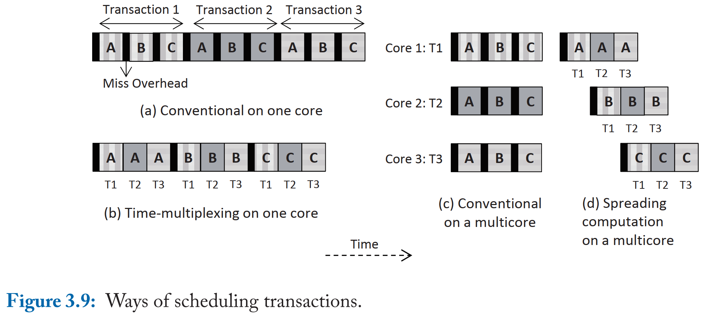

# Databases on Modern Hardware - How to Stop Underutilization and Love Multicores 读书笔记

- [1 Introduction](#1)
- [PART I Implicit/Vertical Scalability]
  - [2 Exploiting Resources of a Processor Core](#2)
  - [3 Minimizing Memory Stalls](#3)
- [PART II Explicit/Horizontal Scalability]
  - [4 Scaling-up OLTP](#4)
  - [5 Scaling-up OLAP Workloads](#5)
- [PART III Conclusions]
  - [6 Outlook](#6)
  - [7 Summary](#7)


&nbsp;   
<a id="1"></a>
## 1 Introduction

### 1.1 IMPLICIT/VERTICAL DIMENSION


- **充分压榨单核性能**（同时受限于散热）
- aggressive microarchitectural features
- instruction/data level parallelism
- memory hierarchy (memory stall, data intensive workloads)
- instruction: compiler optimization, prefetching, computation spreading, txn batching
- data: cache-conscious, partitioning, thread scheduling

### 1.2 EXPLICIT/HORIZONTAL DIMENSION


- **充分利用多核扩展性**（同时受限于核间通信）
- socket communication, shared LLC, NUMA, interconnect bandwidth
- TP: 挑战在于 communication，本文提出 unbounded/fixed/cooperative 尽可能降低 communication
- AP: latency, bandwidth, NU shared everything, topology-aware
  - across-core scheduling：减少 across-core access
  - data placement：减少 latency
  - 这两者互相影响

### 1.3 STRUCTURE OF THE BOOK

- 传统执行模型怎么充分利用硬件
- 最大化利用 data/instr locality
- 在 NU 场景下怎么 scale-up


&nbsp;   
<a id="2"></a>
## 2 Exploiting Resources of a Processor Core


### 2.1 INSTRUCTION AND DATA PARALLELISM


- cpu pipeline: [Processor Microarchitecture an Implementation Perspective 读书笔记](https://github.com/rsy56640/Computer_Architecture_learning/tree/master/Processor%20Microarchitecture%20An%20Implementation%20Perspective%20%E7%AC%94%E8%AE%B0)
- 串行，pipeline，superscalar（同时发射多条指令）


### 2.2 MULTITHREADING


- microarchitectural 资源分割（issue queue, ROB, load/store buffer），对于计算密集型 workload 并不适合
- 资源共享：cache, memory bus，可能导致 cacheline thrashing
- 2.10a：不同 task
- 2.10b：相同 task，但是 MT 处理不同部分数据，instr/data *upper-level* cache 友好，同时切 MT 避免 memory stall。缺点是需要重构软件代码。


- 使用 HT 的场合：
  - 软件本身可以做 HT-awared 的调度与计算
  - 更明确主动地去利用 cpu 计算资源


- master 负责真正的计算；helper 负责 data preloading
- master 通过 work-ahead-set 来通知 helper 接下来需要哪些数据
- 与单纯 prefetching 的区别？
  - 论文中说明：TLB miss 会导致 prefetch 被舍弃，而 helper 是显式触发 load；并不试图降低 total cache miss，而是试图将 cache miss 移出计算线程。
  - 实际上 ia32 optimization 上面说是 page fault

### 2.3 HORIZONTAL PARALLELISM


- 一个 core 负责同一块数据，不同的计算
> - 笔者注：最好计算比较轻，如果计算涉及到大量内存访问，那可能还不如第一种

#### 2.3.1 HORIZONTAL PARALLELISM IN ADVANCED DATABASE SCENARIOS

##### Horizontal parallelism in sorting


- bitonic sort/merge/shuffle
  - 参考 [Fast Sort on CPUs and GPUs: A Case for Bandwidth Oblivious SIMD Sort 论文阅读笔记](https://github.com/rsy56640/paper-reading/tree/master/%E6%95%B0%E6%8D%AE%E5%BA%93/content/Fast%20Sort%20on%20CPUs%20and%20GPUs%20-%20A%20Case%20for%20Bandwidth%20Oblivious%20SIMD%20Sort)
  - `bitonic_merge+`：将Λ或V的数组递增排序
  - `shuffle+`：交换小的放在前面

```c++
// "Λ"/"V" -> "/"
void bitonic_merge+(v[0 : n]) {
  if (size == 1) return;
  shuffle+(v[0 : n]); // "Λ"/"V" -> "∧∨"
  bitonic_merge+(v[0 : n/2]);
  bitonic_merge+(v[n/2 : n]);
}

// "Λ"/"V" -> "∧∨"
void shuffle+(v[0 : n]) {
  if (size == 2) sort then return;
  if ("Λ") {
    swap(v[n/4 : n/2], v[3n/4 : n]);
  } else {
    swap(v[0 : n/4], v[n/2 : 3n/4]);
  }
}
```


- N -> M：将数据分成大小为 M 的块，M 可以 reside in cache
- M -> k：每一块分成大小 k 的总共 P=M/k 份数据，k 是 SIMD width，进行 bitonic sort
- k -> M：对大小为 `k * 2^i` 的数据 merge 时，需要 `2^(i+1)` 个线程。input 每次按照**两个有序数组2等分点**切分，总共切分 `2^(i+1) - 1` 次，共 `2^(i+1)` 份，每个线程输出大小为 k 的块，所有块是有序的。
- M -> N：同上
> - 笔者注：直接递归 bitonic sort 和这个比较？

##### Horizontal parallelism in adaptive indexing


- partition cracking 然后 merge，大量 cache miss
- 按 pivot 两边比例分，能够显著减少 merge 阶段数据移动操作
  - 是否需要先扫描统计一遍

#### 2.3.2 CONCLUSIONS

- single thread: instr/data level parallelism, SIMD, hyperthreading
- multithread


&nbsp;   
<a id="3"></a>
## 3 Minimizing Memory Stalls





&nbsp;   
<a id="4"></a>
## 4 Scaling-up OLTP


&nbsp;   
<a id="5"></a>
## 5 Scaling-up OLAP Workloads


&nbsp;   
<a id="6"></a>
## 6 Outlook


&nbsp;   
<a id="7"></a>
## 7 Summary


