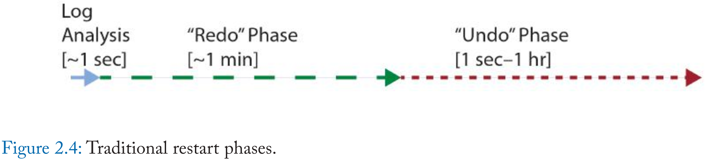

# Instant Recovery with Write-Ahead Logging 2nd 读书笔记

- [1 Introduction](#1)
- [2 Related Prior Work](#2)
- [3 Single-Page Recovery](#3)
- [4 Applications of Single-Page Recovery](#4)
- [5 Instant Restart after a System Failure](#5)
- [6 Applications of Instant Restart](#6)
- [7 Single-Pass Restore](#7)
- [8 Applications of Single-Pass Restore](#8)
- [9 Instant Restore after a Media Failure](#9)
- [10 Applications of Instant Restore](#10)
- [11 Multiple Page, System, and Media Failures](#11)
- [12 Instant Failover](#12)
- [13 Applications of Instant Failover](#13)
- [14 File Systems and Data Files](#14)
- [15 Performance and Scalability](#15)
- [16 Conclusions](#16)

&nbsp;   

## 1 Introduction

&nbsp;   

## 2 Related Prior Work

&nbsp;   

## 3 Single-Page Recovery

&nbsp;   

## 4 Applications of Single-Page Recovery

&nbsp;   

## 5 Instant Restart after a System Failure

&nbsp;   

## 6 Applications of Instant Restart

&nbsp;   

## 7 Single-Pass Restore

&nbsp;   

## 8 Applications of Single-Pass Restore
/Fig7.2.png" width="600"/>

&nbsp;   

## 9 Instant Restore after a Media Failure

&nbsp;   

## 10 Applications of Instant Restore

&nbsp;   

## 11 Multiple Page, System, and Media Failures

&nbsp;   

## 12 Instant Failover

&nbsp;   

## 13 Applications of Instant Failover

&nbsp;   

## 14 File Systems and Data Files

&nbsp;   

## 15 Performance and Scalability

&nbsp;   

## 16 Conclusions

