# Non-Volatile Memory Database Management Systems 笔记

- [1 Introduction](#1)
- [2 The Case for a NVM-Oriented DBMS](#2)
- [3 Storage Management](#3)
- [4 Logging and Recovery](#4)
- [5 Buffer Management](#5)
- [6 Indexing](#6)
- [7 Related Work](#7)
- [8 Future Work](#8)
- [9 Instant Restore after a Media Failure](#9)
- [APPENDIX A: Non-Volatile Memory Emulation](#10)
- [APPENDIX B: Benchmarks](#11)
- [APPENDIX C: H-Store DBMS](#12)

&nbsp;   

## 1 Introduction

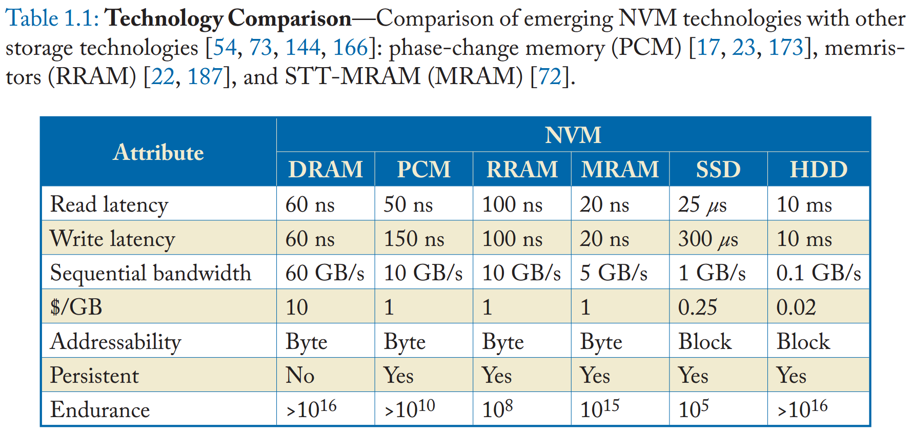

- byte addressability
- high write throughput
- read-write asymmetry

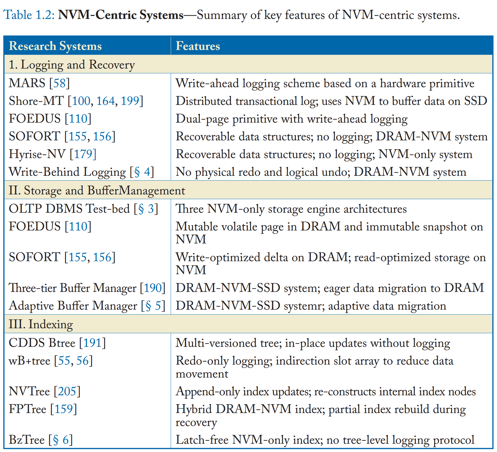

&nbsp;   

## 2 The Case for a NVM-Oriented DBMS

### 2.1 Persisting Data on NVM

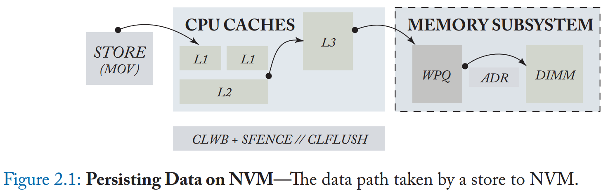

- CLWB(cacheline writeback) 将修改过的 cacheline 写到 WPQ(write pending queue)，*which is power safe*
- SFENCE
  - *"CLWB instruction is ordered only by store-fencing operations. For example, software can use an SFENCE, MFENCE,
XCHG, or LOCK-prefixed instructions to ensure that previous stores are included in the write-back."* - 《IA32 SDM》

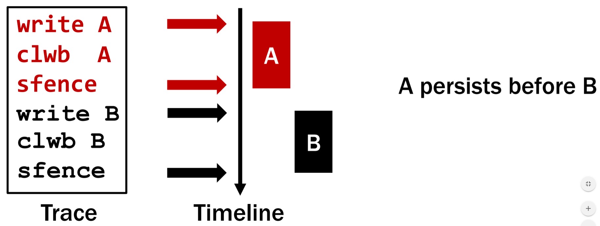

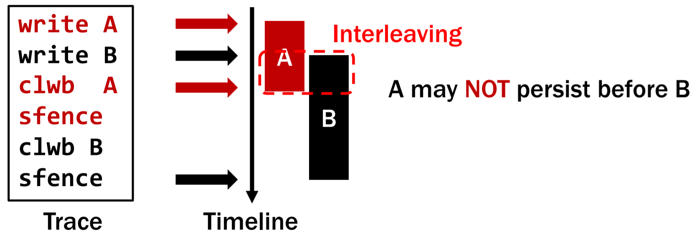

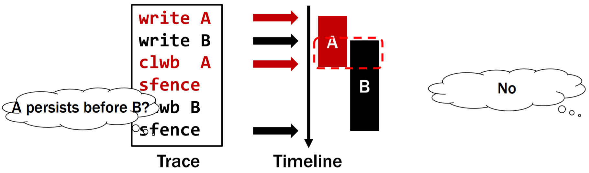

> 我理解是 CLWB 是一种 store-like op，保证了数据一定刷到了内存。   
> store 和 clwb 是同一个地址，所以有序。   
> 那么真正写到内存的时机应该在 store 和 clwb 之间，另外要考虑到 clwb 可能发生 reorder。   

### 2.2 NVM-Only Architecture

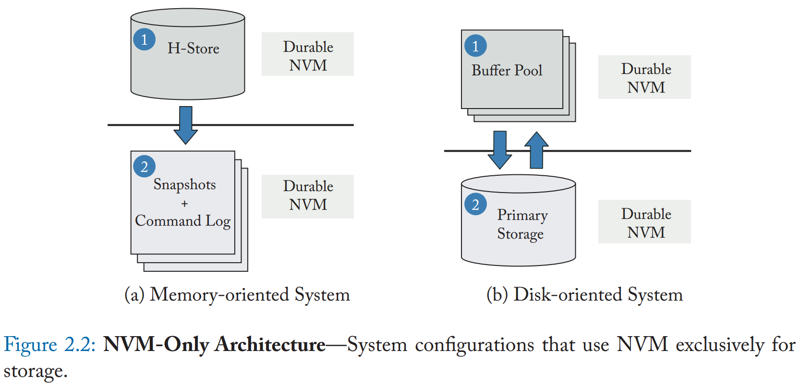

- H-Store
  - logical logging
- MySQL5.5
  - double write

### 2.3 NVM+DRAM Architecture

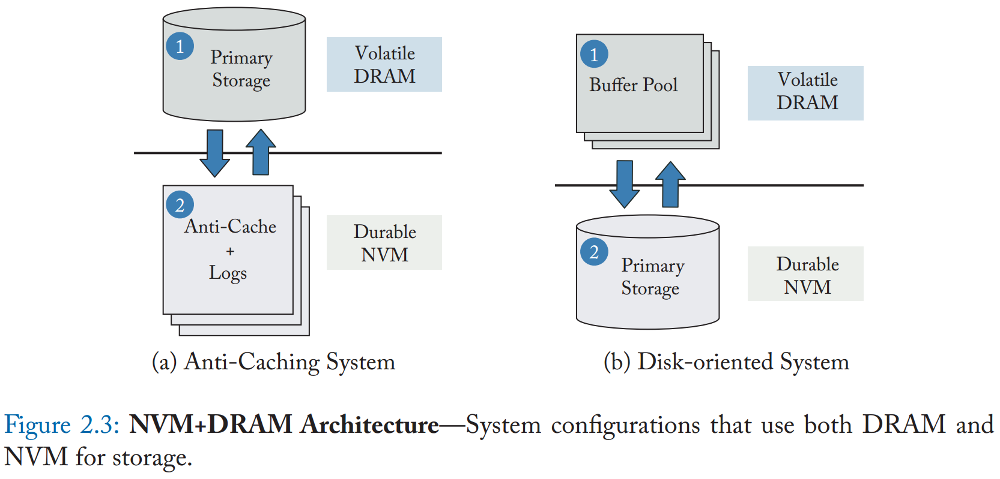

- anti-cache
  - 将纵向的 dbpage fault sync fetch 改为水平化的 async fetch
- disk-oriented

### 2.4 Experimental Evaluation

#### 2.4.3 NVM-Only Architecture

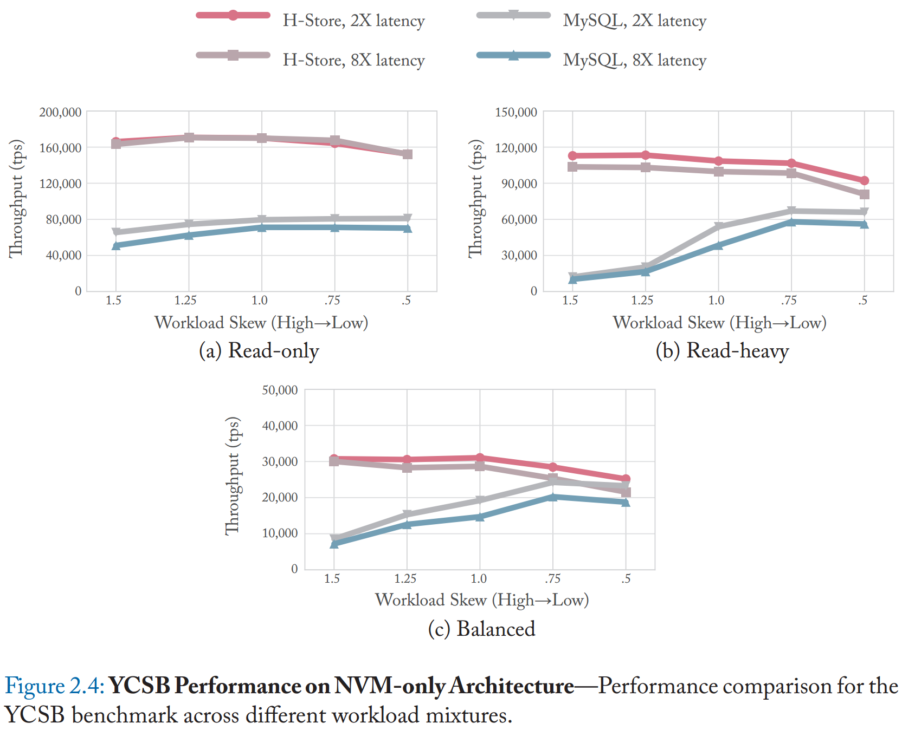

- NVM latency 影响 logging
  - H-Store 受 latency 影响较小，因为 lightweight logical logging
- skew
  - 对于 H-Store，skew 越高，性能略好，原因是 DRAM miss + NVM access
  - 对于 mysql，skew 越高，性能越差，原因是 highweight concurrency control 导致的 lock contention

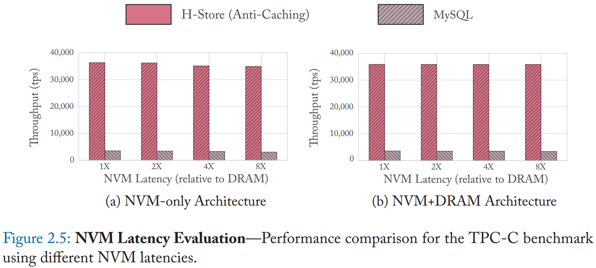

#### 2.4.4 NVM+DRAM Architecture

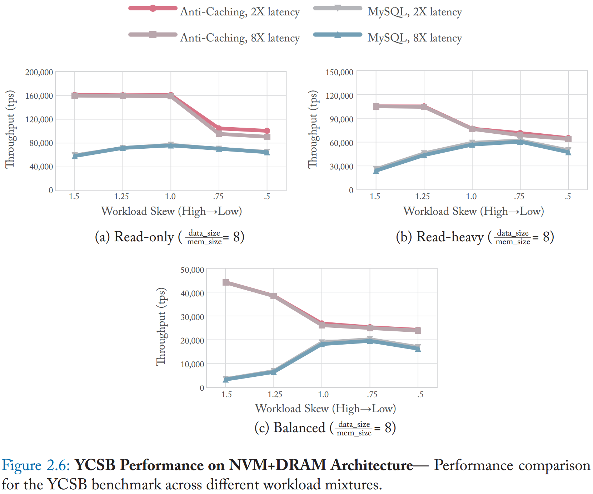

- skew
  - 高 skew
      - anti-caching 性能好（原因是 fetch 少？）
      - mysql 性能差，原因是 lock contention
- NVM latency 没有显著影响
- 影响性能的原因在于数据在 DRAM 和 NVM 中来回交换（fetch & evict）

#### 2.4.5 Recovery

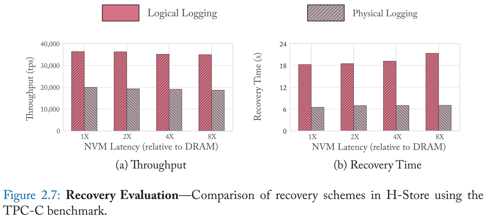

- 需要新的 logging scheme

&nbsp;   

## 3 Storage Management

### 3.1 DBMS Testbed

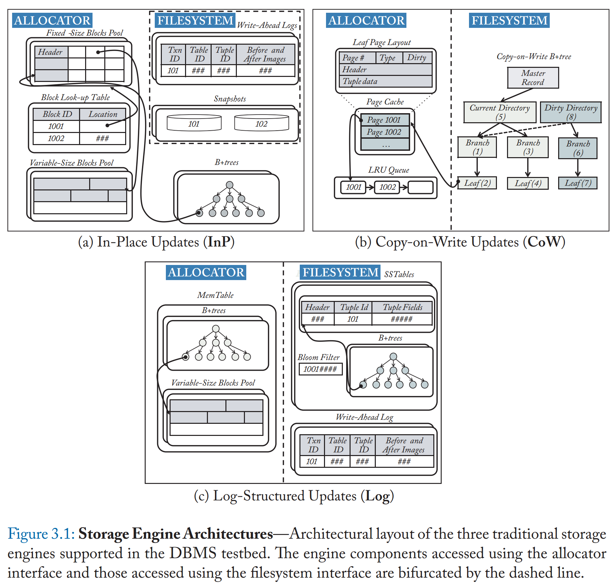

<table>
  <tr>
    <td></td>
    <th scope="col">Storage</th>
    <th scope="col">Logging & Recovery</th>
    <th scope="col">Other</th>
  </tr>
  <tr>
    <th scope="row">In-Place Updates Engine</th>
    <td><li>B+-tree</li>
           <li>fixed-size pool</li>
           <li>variable-size pool</li></td>
    <td><li>ARIES</li>
           <li>rebuild index</li></td>
    <td></td>
  </tr>
  <tr>
    <th scope="row">Copy-on-Write Updates Engine</th>
    <td><li>shadow paging</li>
           <li>CoW B+-tree</li></td>
    <td>NULL</td>
    <td><li>group commit</li>
           <li>write amplification</li>
           <li>GC</li></td>
  </tr>
  <tr>
    <th scope="row">Log-Structured Updates Engine</th>
    <td><li>LSM-tree</li>
           <li>MemTable</li>
           <li>SSTable</li></td>
    <td><li>WAL</li>
           <li>batch log</li></td>
    <td><li>reduce random writes</li>
           <li>write-intensive workload</li>
           <li>read amplification</li>
           <li>Compaction</li></td>
  </tr>
</table>

### 3.2 NVM-Aware Engines

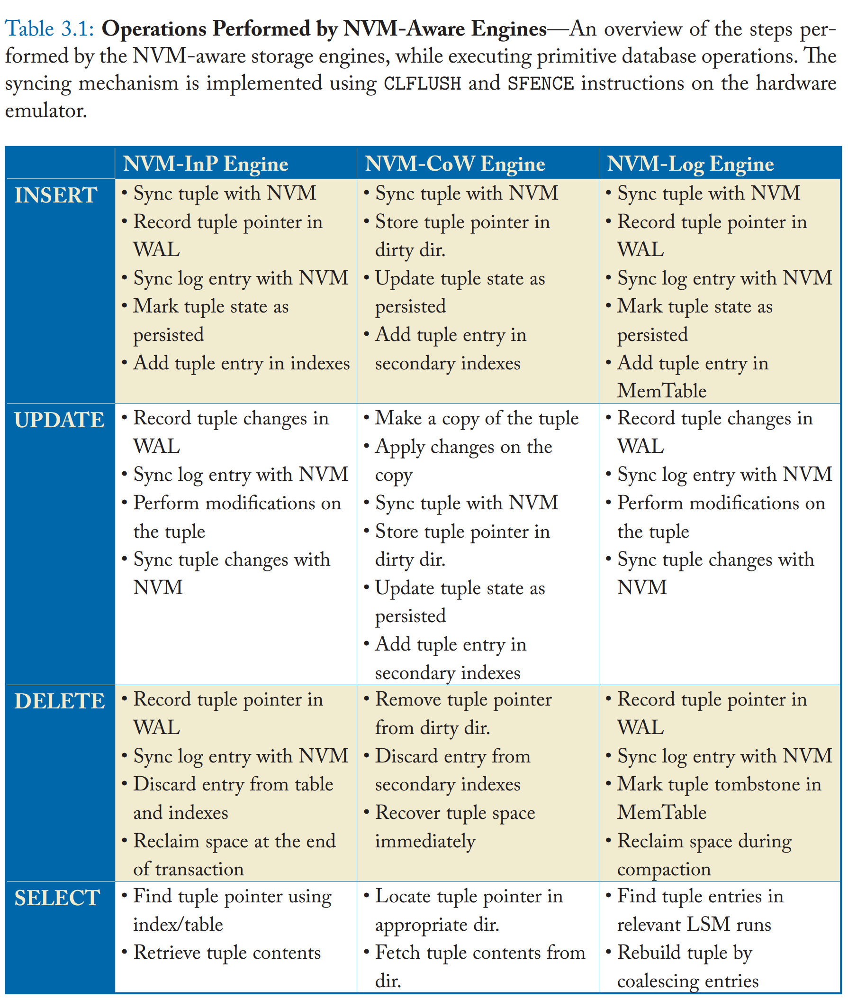

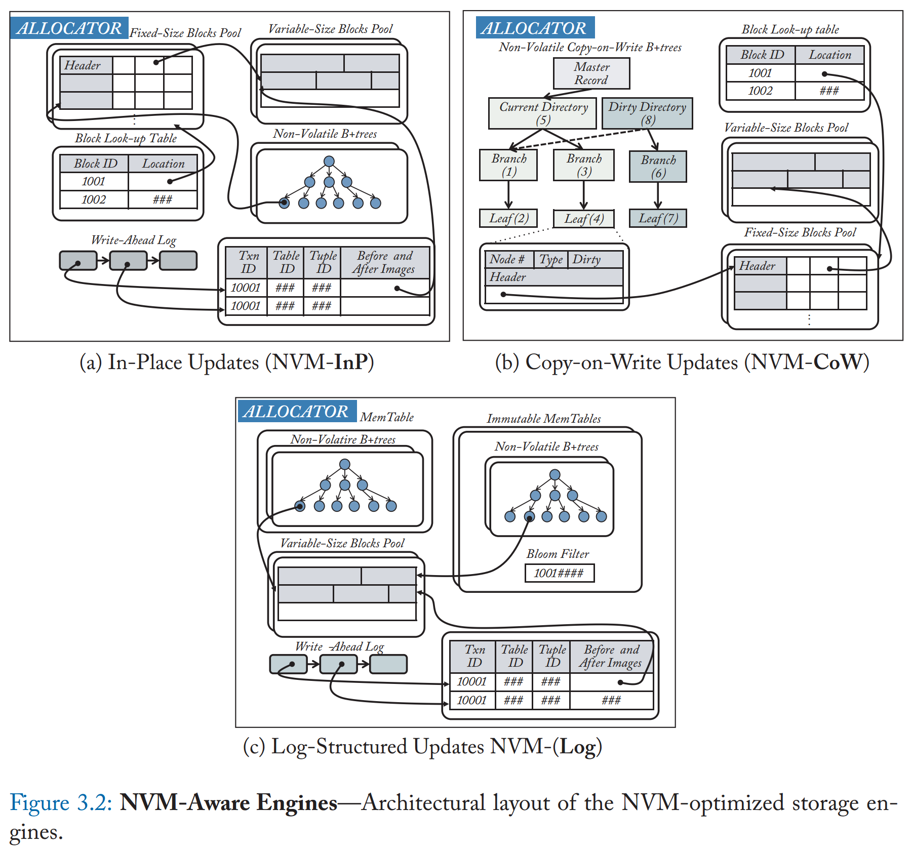

<table>
  <tr>
    <td></td>
    <th scope="col">Storage</th>
    <th scope="col">Logging & Recovery</th>
    <th scope="col">Other</th>
  </tr>
  <tr>
    <th scope="row">In-Place Updates Engine</th>
    <td><li>non-volatile B+-tree (atomic)</li>
           <li>先写数据，然后 WAL entry 记录指针，最后修改 slot 为 persisted</li></td>
    <td><li>Undo 释放空间</li></td>
    <td></td>
  </tr>
  <tr>
    <th scope="row">Copy-on-Write Updates Engine</th>
    <td><li>data, tree node, master record</li></td>
    <td>NULL</td>
    <td><li>GC</li></td>
  </tr>
  <tr>
    <th scope="row">Log-Structured Updates Engine</th>
    <td><li>不需要 flush MemTable，只需要标记为 immutable，然后开始新 MemTable</li></td>
    <td><li>Undo MemTable</li>
           <li>不需要 rebuild MemTable</li></td>
    <td><li>Compaction</li></td>
  </tr>
</table>

### 3.3 Experimental Evaluation

#### 3.3.2 Runtime Performance

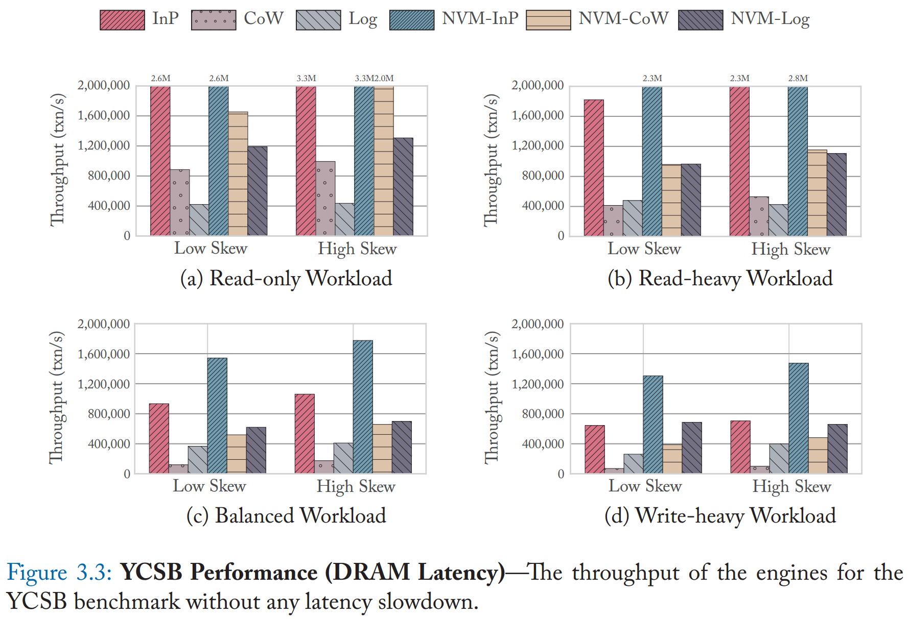

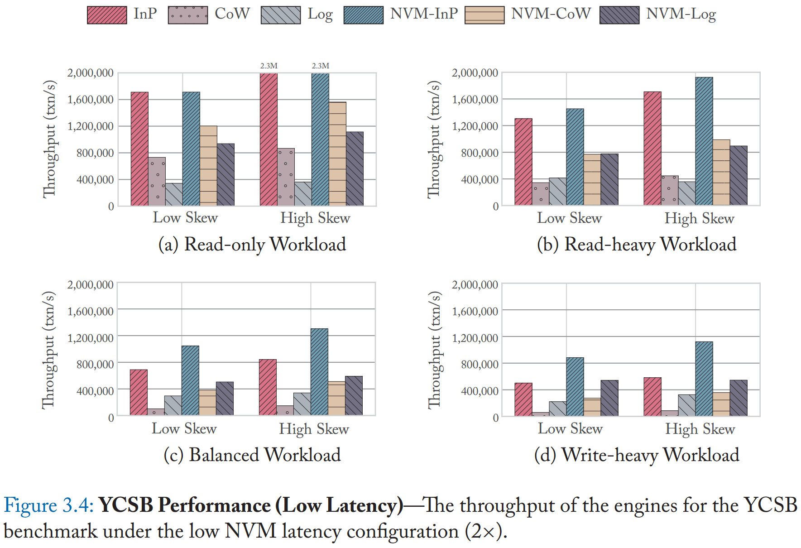

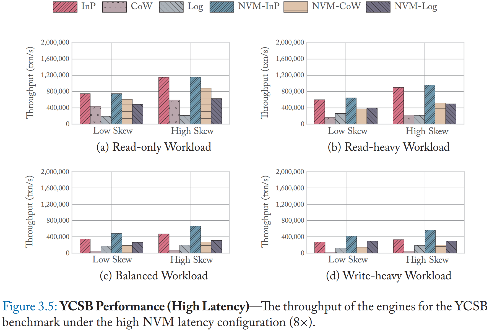

<table>
  <tr>
    <td></td>
    <th scope="col">Read-only</th>
    <th scope="col">Read-heavy</th>
    <th scope="col">Balanced & Write-heavy</th>
  </tr>
  <tr>
    <th scope="row">NVM-Inp & Inp</th>
    <td></td>
    <td>lightweight logging</td>
    <td>lightweight logging</td>
  </tr>
  <tr>
    <th scope="row">NVM-CoW & CoW</th>
    <td>master record</td>
    <td>persist dir & node</td>
    <td>lightweight logging</td>
  </tr>
  <tr>
    <th scope="row">NVM-Log & Log</th>
    <td>tuple coalescing</td>
    <td></td>
    <td>copy of tuple</td>
  </tr>
</table>

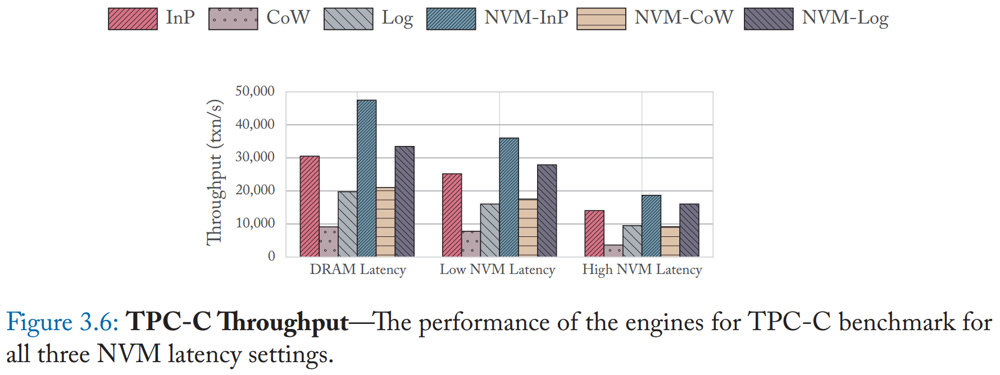

#### 3.3.3 Reads and Writes

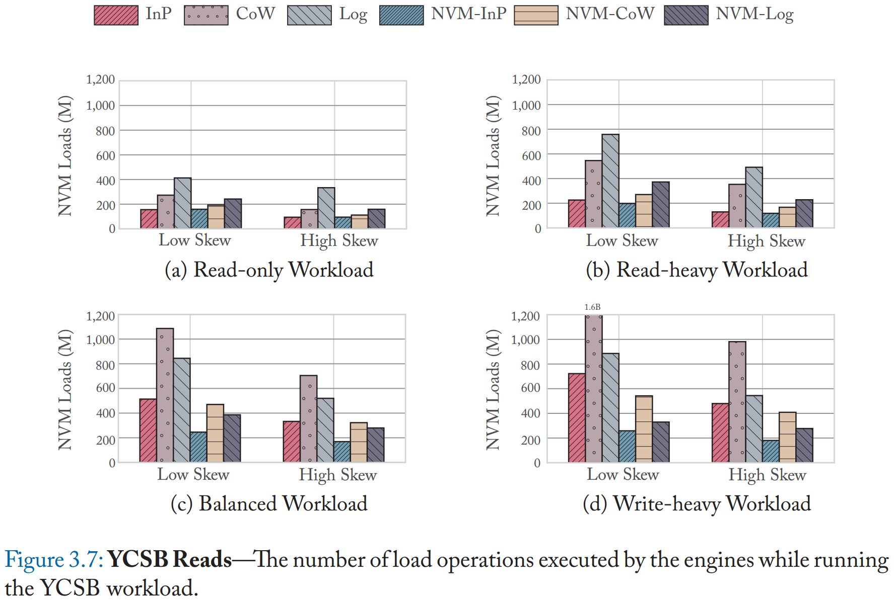

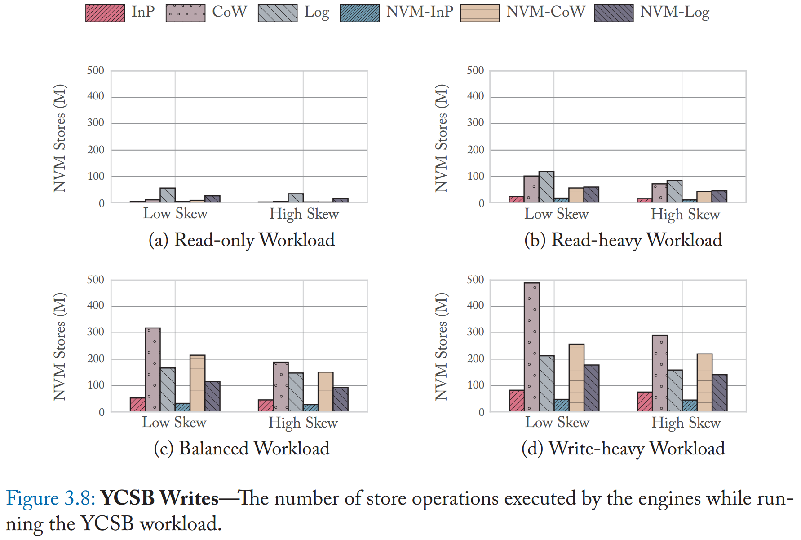

- NVM-Inp & Inp
- NVM-CoW & CoW: copy dir & node
- NVM-Log & Log: tuple coalescing

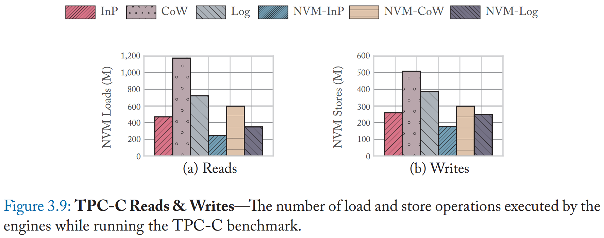

#### 3.3.4 Recovery

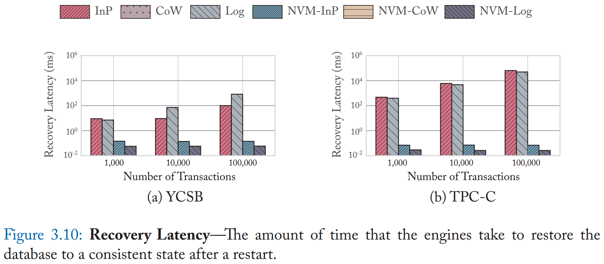

- NVM-Inp & Inp：只需 undo，不依赖于 chkpt，只依赖于 failure 时 active txn 数量
- NVM-CoW & CoW：不需要 recovery，async GC
- NVM-Log & Log：只需 undo，不依赖于 chkpt，只依赖于 failure 时 active txn 数量

#### 3.3.5 Execution Time Breakdown

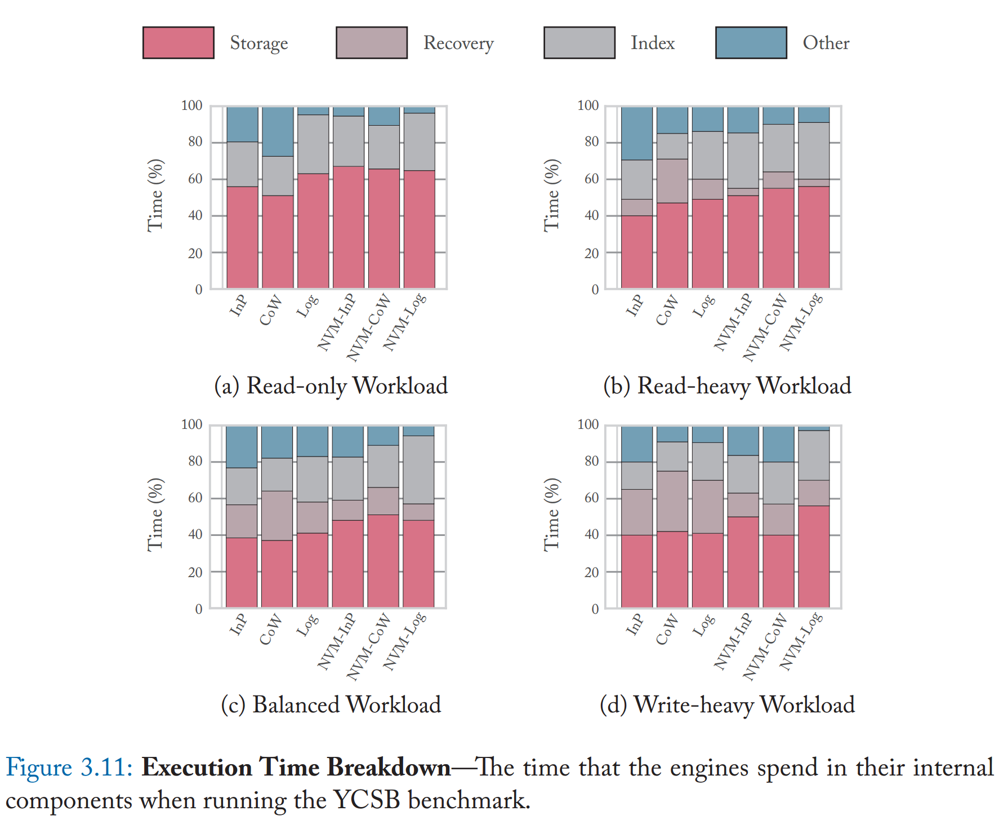

- NVM-Inp & Inp
  - other：？？？
- NVM-CoW & CoW
  - recovery 占比高：copy dir & node（*这个应该算 storage 吧*）
  - other：Compaction
- NVM-Log & Log
  - index 占比高：LSM-tree multiple index lookup

#### 3.3.6 Storage Footprint

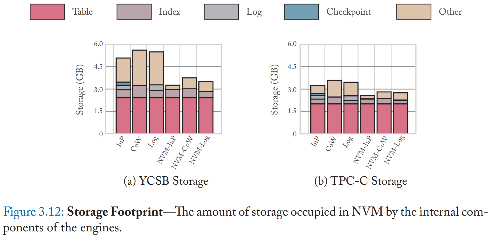

- NVM-Inp & Inp: lightweight logging
- NVM-CoW & CoW: copy dir & node
- NVM-Log & Log: lightweight logging

#### 3.3.7 Analytical Cost Model

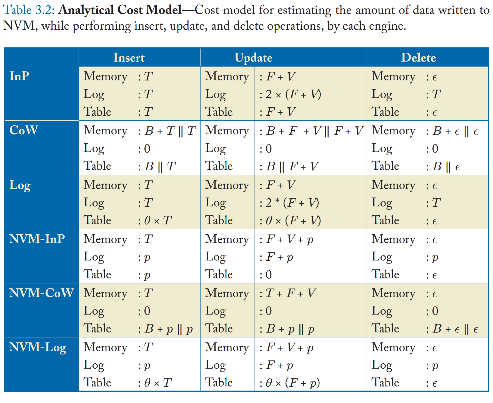

- **T**: tuple size
- **F**: fixed-length field
- **V**: variable-length field
- **p**: pointer size
- **θ**: write amplification factor for LSM Compaction
- **B**: CoW B+-tree node size
- **ϵ**: fixed-length write to NVM

- NVM-Inp & Inp: lightweight logging
- NVM-CoW & CoW: copy dir & node
- NVM-Log & Log: lightweight logging

#### 3.3.8 Impact of B+-Tree Node Size

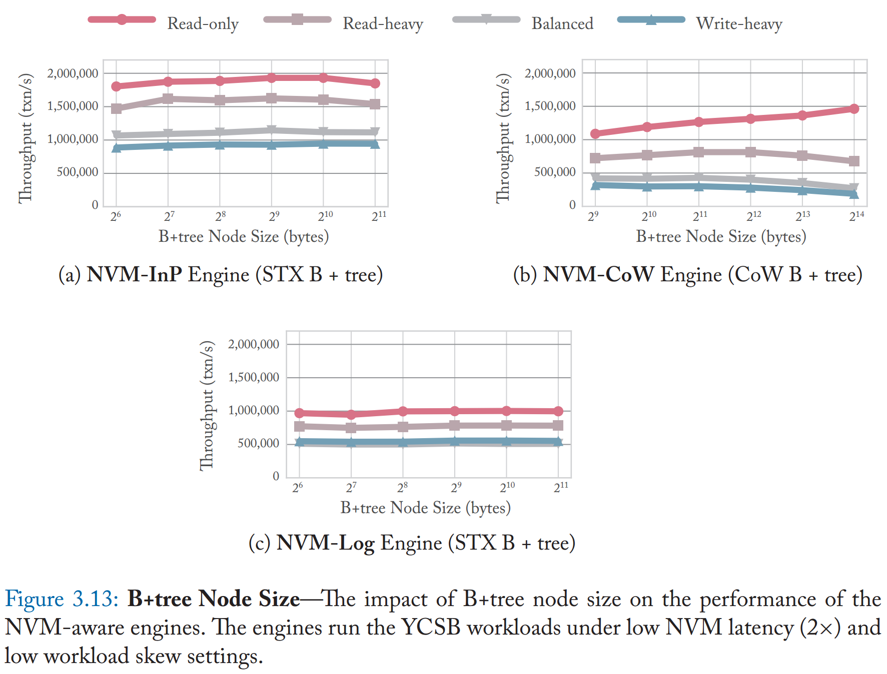

- NVM-Inp: STX B+-tree
- NVM-CoW: append-only CoW B+-tree
  - tree depth indirection
  - copy dir & node depth
- NVM-Log: STX B+-tree

#### 3.3.9 NVM Instruction Set Extensions

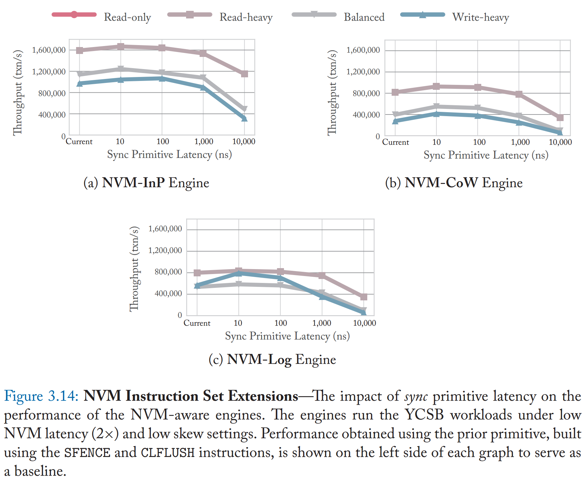

#### 3.3.10 Discussion

- NVM access latency
- fewer store op, extend NVM lifetime
- no data copy
- lightweight logging

### 3.4 Summary

- NVM-Inp 表现较好，对设备磨损较少

&nbsp;   

## 4 Logging and Recovery

&nbsp;   

## 5 Buffer Management

&nbsp;   

## 6 Indexing

&nbsp;   

## 7 Related Work

&nbsp;   

## 8 Future Work

&nbsp;   

## 9 Conclusion

&nbsp;   

## APPENDIX A: Non-Volatile Memory Emulation

&nbsp;   

## APPENDIX B: Benchmarks

&nbsp;   

## APPENDIX C: H-Store DBMS

