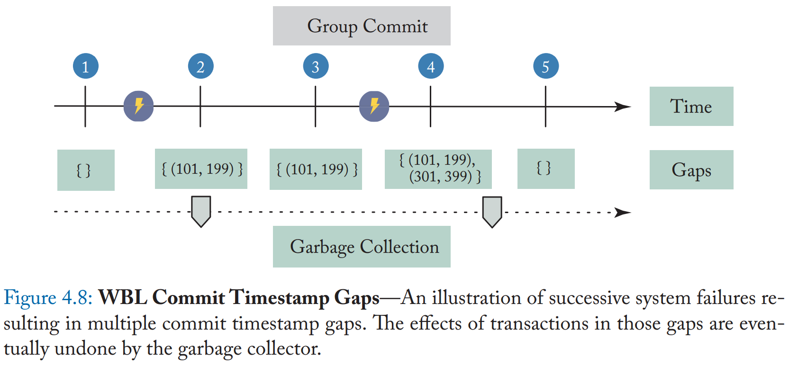
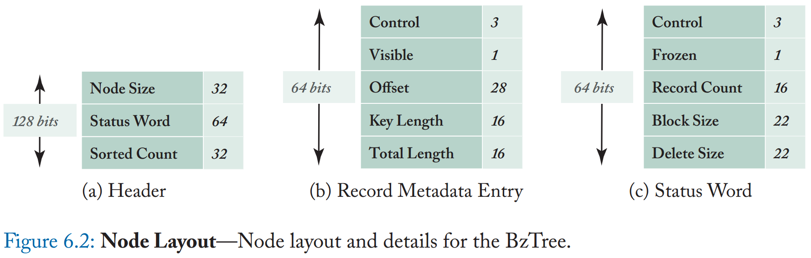

# Non-Volatile Memory Database Management Systems 笔记

- [1 Introduction](#1)
- [2 The Case for a NVM-Oriented DBMS](#2)
- [3 Storage Management](#3)
- [4 Logging and Recovery](#4)
- [5 Buffer Management](#5)
- [6 Indexing](#6)
- [7 Related Work](#7)
- [8 Future Work](#8)
- [9 Instant Restore after a Media Failure](#9)
- [APPENDIX A: Non-Volatile Memory Emulation](#10)
- [APPENDIX B: Benchmarks](#11)
- [APPENDIX C: H-Store DBMS](#12)

&nbsp;   

## 1 Introduction

- byte addressability
- high write throughput
- read-write asymmetry

&nbsp;   

## 2 The Case for a NVM-Oriented DBMS

### 2.1 Persisting Data on NVM

- CLWB(cacheline writeback) 将修改过的 cacheline 写到 WPQ(write pending queue)，*which is power safe*
- SFENCE
  - *"CLWB instruction is ordered only by store-fencing operations. For example, software can use an SFENCE, MFENCE,
XCHG, or LOCK-prefixed instructions to ensure that previous stores are included in the write-back."* - 《IA32 SDM》

> 我理解是 CLWB 是一种 store-like op，保证了数据一定刷到了内存。   
> store 和 clwb 是同一个地址，所以有序。   
> 那么真正写到内存的时机应该在 store 和 clwb 之间，另外要考虑到 clwb 可能发生 reorder。   

### 2.2 NVM-Only Architecture

- H-Store
  - logical logging
- MySQL5.5
  - double write

### 2.3 NVM+DRAM Architecture

- anti-cache
  - 将纵向的 dbpage fault sync fetch 改为水平化的 async fetch
- disk-oriented

### 2.4 Experimental Evaluation

#### 2.4.3 NVM-Only Architecture

- NVM latency 影响 logging
  - H-Store 受 latency 影响较小，因为 lightweight logical logging
- skew
  - 对于 H-Store，skew 越高，性能略好，原因是 DRAM miss + NVM access
  - 对于 mysql，skew 越高，性能越差，原因是 highweight concurrency control 导致的 lock contention

#### 2.4.4 NVM+DRAM Architecture

- skew
  - 高 skew
      - anti-caching 性能好（原因是 fetch 少？）
      - mysql 性能差，原因是 lock contention
- NVM latency 没有显著影响
- 影响性能的原因在于数据在 DRAM 和 NVM 中来回交换（fetch & evict）

#### 2.4.5 Recovery

- 需要新的 logging scheme

&nbsp;   

## 3 Storage Management

### 3.1 DBMS Testbed

<table>
  <tr>
    <td></td>
    <th scope="col">Storage</th>
    <th scope="col">Logging & Recovery</th>
    <th scope="col">Other</th>
  </tr>
  <tr>
    <th scope="row">In-Place Updates Engine</th>
    <td><li>B+-tree</li>
           <li>fixed-size pool</li>
           <li>variable-size pool</li></td>
    <td><li>ARIES</li>
           <li>rebuild index</li></td>
    <td></td>
  </tr>
  <tr>
    <th scope="row">Copy-on-Write Updates Engine</th>
    <td><li>shadow paging</li>
           <li>CoW B+-tree</li></td>
    <td>NULL</td>
    <td><li>group commit</li>
           <li>write amplification</li>
           <li>GC</li></td>
  </tr>
  <tr>
    <th scope="row">Log-Structured Updates Engine</th>
    <td><li>LSM-tree</li>
           <li>MemTable</li>
           <li>SSTable</li></td>
    <td><li>WAL</li>
           <li>batch log</li></td>
    <td><li>reduce random writes</li>
           <li>write-intensive workload</li>
           <li>read amplification</li>
           <li>Compaction</li></td>
  </tr>
</table>

### 3.2 NVM-Aware Engines

<table>
  <tr>
    <td></td>
    <th scope="col">Storage</th>
    <th scope="col">Logging & Recovery</th>
    <th scope="col">Other</th>
  </tr>
  <tr>
    <th scope="row">In-Place Updates Engine</th>
    <td><li>non-volatile B+-tree (atomic)</li>
           <li>先写数据，然后 WAL entry 记录指针，最后修改 slot 为 persisted</li></td>
    <td><li>Undo 释放空间</li></td>
    <td></td>
  </tr>
  <tr>
    <th scope="row">Copy-on-Write Updates Engine</th>
    <td><li>data, tree node, master record</li></td>
    <td>NULL</td>
    <td><li>GC</li></td>
  </tr>
  <tr>
    <th scope="row">Log-Structured Updates Engine</th>
    <td><li>不需要 flush MemTable，只需要标记为 immutable，然后开始新 MemTable</li></td>
    <td><li>Undo MemTable</li>
           <li>不需要 rebuild MemTable</li></td>
    <td><li>Compaction</li></td>
  </tr>
</table>

### 3.3 Experimental Evaluation

#### 3.3.2 Runtime Performance

<table>
  <tr>
    <td></td>
    <th scope="col">Read-only</th>
    <th scope="col">Read-heavy</th>
    <th scope="col">Balanced & Write-heavy</th>
  </tr>
  <tr>
    <th scope="row">NVM-Inp & Inp</th>
    <td></td>
    <td>lightweight logging</td>
    <td>lightweight logging</td>
  </tr>
  <tr>
    <th scope="row">NVM-CoW & CoW</th>
    <td>master record</td>
    <td>persist dir & node</td>
    <td>lightweight logging</td>
  </tr>
  <tr>
    <th scope="row">NVM-Log & Log</th>
    <td>tuple coalescing</td>
    <td></td>
    <td>copy of tuple</td>
  </tr>
</table>

#### 3.3.3 Reads and Writes

- NVM-Inp & Inp
- NVM-CoW & CoW: copy dir & node
- NVM-Log & Log: tuple coalescing

#### 3.3.4 Recovery

- NVM-Inp & Inp：只需 undo，不依赖于 chkpt，只依赖于 failure 时 active txn 数量
- NVM-CoW & CoW：不需要 recovery，async GC
- NVM-Log & Log：只需 undo，不依赖于 chkpt，只依赖于 failure 时 active txn 数量

#### 3.3.5 Execution Time Breakdown

- NVM-Inp & Inp
  - other：？？？
- NVM-CoW & CoW
  - recovery 占比高：copy dir & node（*这个应该算 storage 吧*）
  - other：Compaction
- NVM-Log & Log
  - index 占比高：LSM-tree multiple index lookup

#### 3.3.6 Storage Footprint

- NVM-Inp & Inp: lightweight logging
- NVM-CoW & CoW: copy dir & node
- NVM-Log & Log: lightweight logging

#### 3.3.7 Analytical Cost Model

- **T**: tuple size
- **F**: fixed-length field
- **V**: variable-length field
- **p**: pointer size
- **θ**: write amplification factor for LSM Compaction
- **B**: CoW B+-tree node size
- **ϵ**: fixed-length write to NVM

- NVM-Inp & Inp: lightweight logging
- NVM-CoW & CoW: copy dir & node
- NVM-Log & Log: lightweight logging

#### 3.3.8 Impact of B+-Tree Node Size

- NVM-Inp: STX B+-tree
- NVM-CoW: append-only CoW B+-tree
  - tree depth indirection
  - copy dir & node depth
- NVM-Log: STX B+-tree

#### 3.3.9 NVM Instruction Set Extensions

#### 3.3.10 Discussion

- NVM access latency
- fewer store op, extend NVM lifetime
- no data copy
- lightweight logging

### 3.4 Summary

- NVM-Inp 表现较好，对设备磨损较少

&nbsp;   

## 4 Logging and Recovery

### 4.1 Recovery Principles

- **steal**：允许 flush uncommitted txn 的 dirty page
- **no-force**：commit 时不要求 flush dirty page
- **WAL** + **checkpoint**
- **recovery**：analysis, redo, undo

### 4.2 Write-Ahead Logging

#### 4.2.1 Runtime Operation

- **DPT** (dirty page table, redo)：记录 dirty page + 最早修改的 LSN
- **ATT** (active txn table, undo)：记录 active txn + 最后 LSN
- fuzzy checkpoint
  - CHECKPOINT-BEGIN
  - CHECKPOINT-END：记录 DPT 和 ATT（checkpoint-begin 时的 image）
- MVCC 是 consistent checkpoint：只记录 committed txn 的修改，不记录在 checkpoint 开始之后开始的 txn 修改

#### 4.2.2 Commit Protocol

- ATT 中插入 txn，标记为 active
- 所有修改生成 log entry，更新 txn LSN
- sync batched log (group commit)

#### 4.2.3 Recovery Protocol

### 4.3 Write-Behind Logging (MVCC)

- [Write-Behind Logging 论文阅读笔记](https://github.com/rsy56640/paper-reading/tree/master/%E6%95%B0%E6%8D%AE%E5%BA%93/content/Write-Behind%20Logging)
- NVM 写吞吐比传统设备高出若干数量级
- NVM 随机写和顺序写的性能差距缩小
- NVM 是 byte-addressable
- CPU 不能防止数据从 cache 写到 NVM
- 不记录 before-image：MVCC
- 不记录 after-image：NVM

#### 4.3.1 Runtime Operation

- **DTT (dirty tuple table)：不写到 NVM，一直在 memory**
- 写新版本数据
- 记录 (txn-id, table, meta, data pointer) 到 DTT

#### 4.3.2 Commit Protocol

> 感觉书中描述有误。   

- 开启一轮 group commit，计算 commit-ts 区间 [C_p, C_d)
- 写 log `GROUP-BEGIN { { Cl }, [C_p, C_d) }` 到 NVM
- 执行 TP，同时维护 DTT（为了执行 runtime undo）
- 根据 DTT，sync dirty tuple 到 NVM
- 写 log `GROUP-END { { Cl' }, [C_p, C_d) }` 到 NVM
- 通知 commit

可以理解为 `GROUP-BEGIN` 是这一轮开启时未提交的，`GROUP-END` 是这一轮结束时已经提交的。`GROUP-BEGIN` - `GROUP-END` 就是还未提交的。

#### 4.3.3 Recovery Protocol

- failure 表示一个 group commit-ts gap 中的 txn abort，之后被 GC

- 找到最后一个 `GROUP-BEGIN`
- 找到其对应的 `GROUP-END`，如果没有就默认为 NULL
- `GROUP-BEGIN` - `GROUP-END` 就是 abort txn
- 如何忽略这些 tuple
  - MVCC，难道访问前还检查一下 commit-ts 是否有效？
- background GC

### 4.4 Replication

- WAL record

### 4.5 Experimental Evaluation

- WBL 在 SSD/HDD 上表现不如 WAL，因为 random write

- WBL recovery time 和 txn 数量无关

- NVM latency 对写操作影响更明显，原因是 cacheline contention

- CLWB 有利于 WBL，原因是？？？

- 不同的 group commit latency 倾向于不同的存储设备

### 4.6 Summary

- WBL, throughput, latency, availability, storage footprint

&nbsp;   

## 5 Buffer Management

### 5.2 NVM-Aware Buffer Management

#### 5.2.1 New Data Migration Paths

- 主要看 workload
  - working set size
  - access pattern
  - frequency of NVM writes

### 5.3 Adaptive Data Migration

- T: throughput
- W: write to NVM
- Cost Function: `Cost(T, W) = L1*T - L2*W`

### 5.4 Storage Hierarchy Selection

- 模型有点勉强

### 5.6 Experimental Evaluation

#### 5.6.2 Workload Skew Characterization

#### 5.6.3 Impact of NVM on Runtime Performance

- 大量小事务需要频繁写回
- 如果 working set 不能 fit in DRAM，那么 NVM-SSD 性能好

- fit in NVM

#### 5.6.4 Storage Hierarchy Recommendation

- working set size
- frequency of NVM writes
- system cost budget

#### 5.6.5 Data Migration Policies

#### 5.6.6 Buffer Management Policy Comparison

#### 5.6.7 Adaptive Data Migration

### 5.7 Summary

- multi-tier storage hierarchy
- data migration policy

&nbsp;   

## 6 Indexing

- 需要对多个内存位置做 atomic 操作
  - 引入 indirection layer：BwTree
  - PMwCAS：BzTree
- persistence guarantee
- simple recovery

### 6.1 Persistent Multi-Word CAS

- [Easy Lock-Free Indexing in Non-Volatile Memory 论文阅读笔记](https://github.com/rsy56640/paper-reading/tree/master/%E6%95%B0%E6%8D%AE%E5%BA%93/content/Easy%20Lock-Free%20Indexing%20in%20Non-Volatile%20Memory)
- [PIRL 2019: Experience on building a lock-free B+-tree in persistent memory - youtube](https://www.youtube.com/watch?v=nAfMtiUlOqI)

### 6.2 BzTree Architecture and Design

### 6.3 BzTree Nodes

#### 6.3.1 Node Layout

- slotted-page layout
  - fixed meta 从上到下
  - variable data 从下到上
- header
- meta array

#### 6.3.2 Leaf Node Operations

- **insert**
- **delete**
- **update**
- **upsert**
- **read**
- **range scan**

### 6.4 Structure Modifications

- **split**
- **merge**

### 6.5 BzTree Durability and Recovery

#### 6.5.1 Persistent Memory Allocator

- allocate
- activated
- free

#### 6.5.2 Durability

- variable-length
  - flush-before-visible protocol
- word-length
  - PMwCAS

#### 6.5.3 Recovery

- memory lifetime
  - PMwCAS policy
- PMwCAS recovery
- index structure recovery
  - index 自己检查：epoch
  - 要考虑到 allocator 和 index 在 object ownership transfer 上的问题

### 6.6 Experimental Evaluation

- BzTree
  - inter-link node
  - in-place update
- BwTree
  - indirect table
  - update by delta: pointer chasing

- durability: CLFLUSH (CLWB in future)

- Bwtree: pointer chasing, delta apply

- key 越大，split 次数越多，key comparison 开销越大
- free space：（没看懂）越小 key comparison 开销越小，但是 split 开销越大

### 6.7 Summary

- simplicity：PMwCAS 使得 BzTree 不那么复杂
- flexibility：DRAM 和 NVM 均可，8% persistence 开销
- recovery

&nbsp;   

## 7 Related Work

### 7.1 Logging & Recovery

### 7.2 File Systems

### 7.3 Replication

### 7.4 Memory Management

### 7.5 Hardware Support

### 7.6 Software Testing

### 7.7 Latch-Free Indexes

### 7.8 Multi-Word CAS

### 7.9 Persistent Indexes

&nbsp;   

## 8 Future Work

&nbsp;   

## 9 Conclusion

&nbsp;   

## APPENDIX A: Non-Volatile Memory Emulation

&nbsp;   

## APPENDIX B: Benchmarks

&nbsp;   

## APPENDIX C: H-Store DBMS

