# [The Design and Implementation of Modern Column-Oriented Database Systems](https://dl.acm.org/doi/10.5555/2602024) 笔记

- [1 Introduction](#1)
- [2 History, trends, and performance tradeoffs](#2)
- [3 Column-store Architectures](#3)
- [4 Column-store internals and advanced techniques](#4)
- [5 Discussion, Conclusions, and Future Directions](#5)

&nbsp;   

## 1 Introduction

- [The design and implementation of modern column-oriented database systems - the morning paper](https://blog.acolyer.org/2018/09/26/the-design-and-implementation-of-modern-column-oriented-database-systems/)

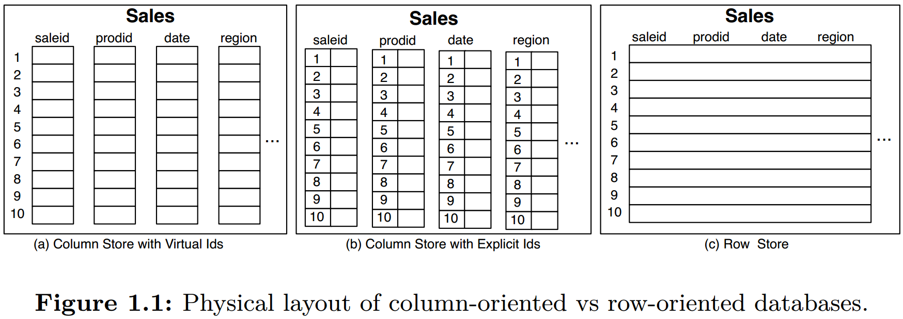

- offset 寻址 record, fixed-width（考虑 compression）
- block processing, cpu utilization
- late materialization, memory bandwidth
- compression
- 直接在 compressed data 上做计算
- join
- sorted column
- I/O pattern: write optimized memory buffer -> batched  flush compressed column

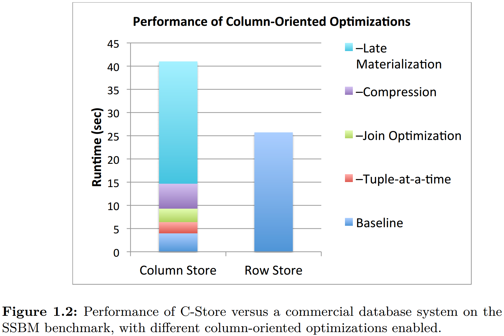

&nbsp;   

## 2 History, trends, and performance tradeoffs

### 2.1 History

### 2.2 Technology and Application Trends

### 2.3 Fundamental Performance Tradeo!s

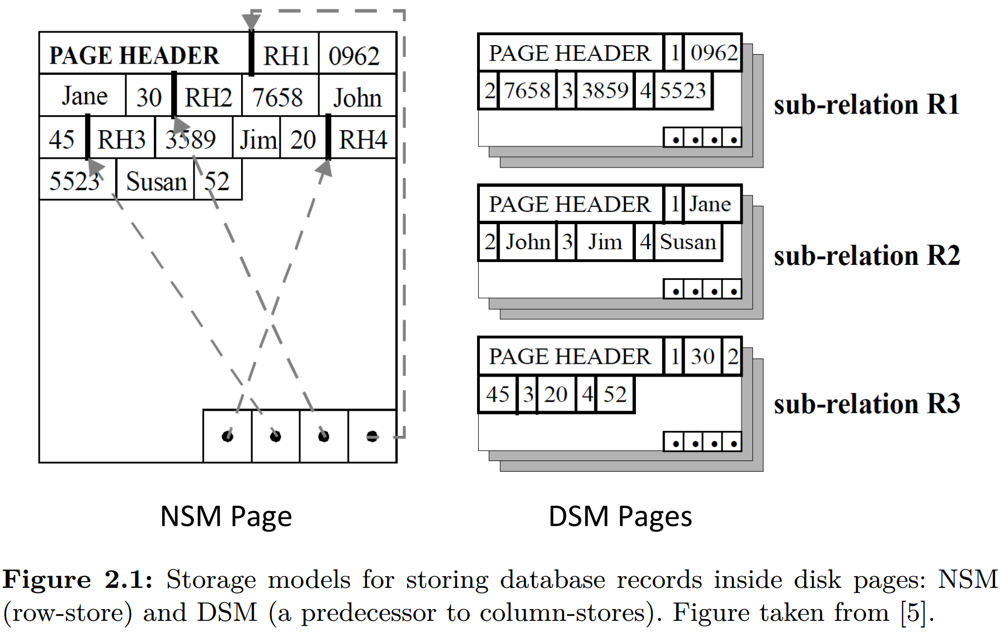

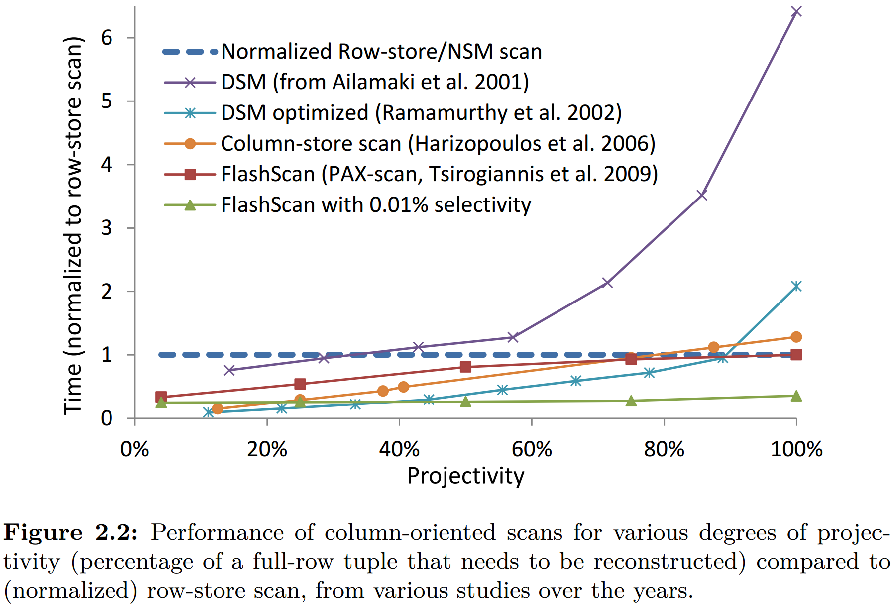

&nbsp;   

## 3 Column-store Architectures

### 3.1 C-Store

### 3.2 MonetDB and VectorWise

### 3.3 Other Implementations

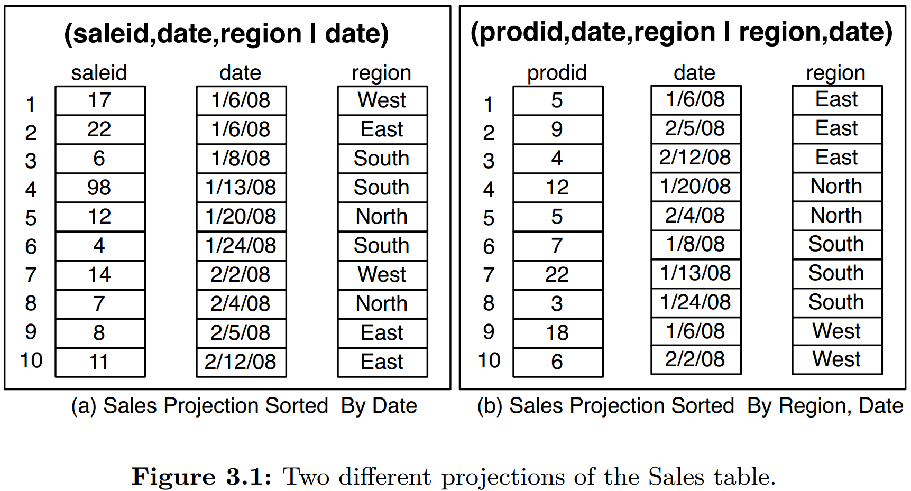

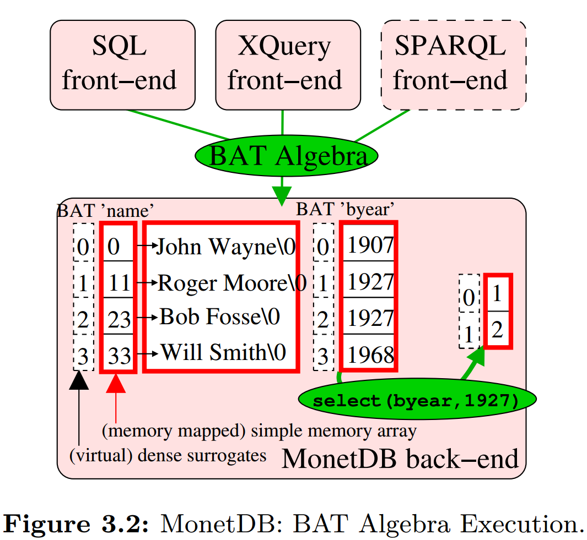

&nbsp;   

## 4 Column-store internals and advanced techniques

### 4.1 Vectorized Processing

### 4.2 Compression

### 4.3 Operating Directly on Compressed Data

### 4.4 Late Materialization

### 4.5 Joins

### 4.6 Group-by, Aggregation and Arithmetic Operations

### 4.7 Inserts/updates/deletes

### 4.8 Indexing, Adaptive Indexing and Database Cracking

### 4.9 Summary and Design Principles Taxonomy

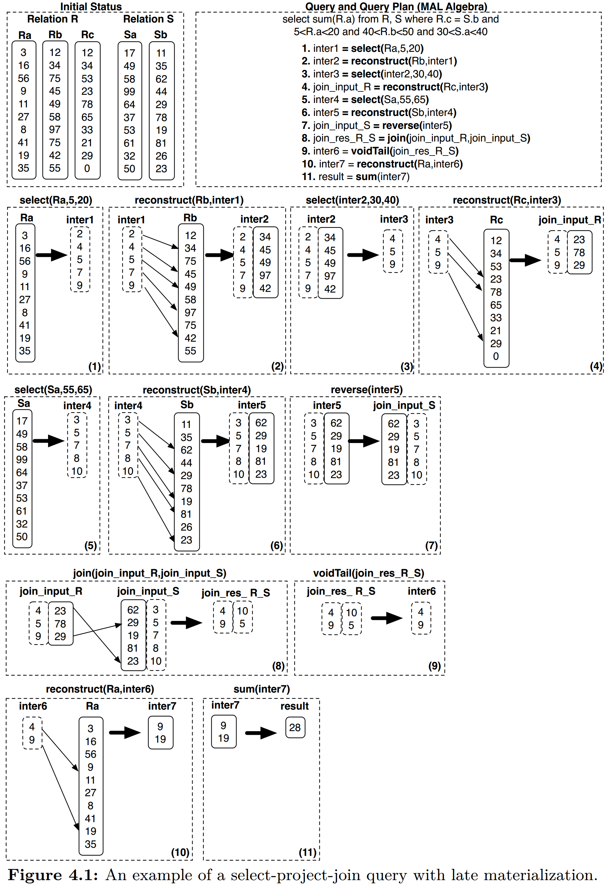

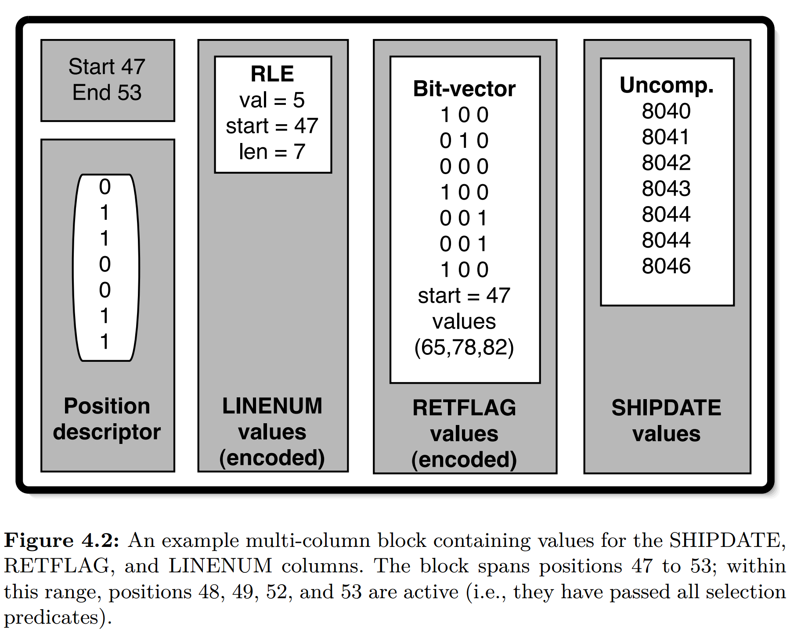

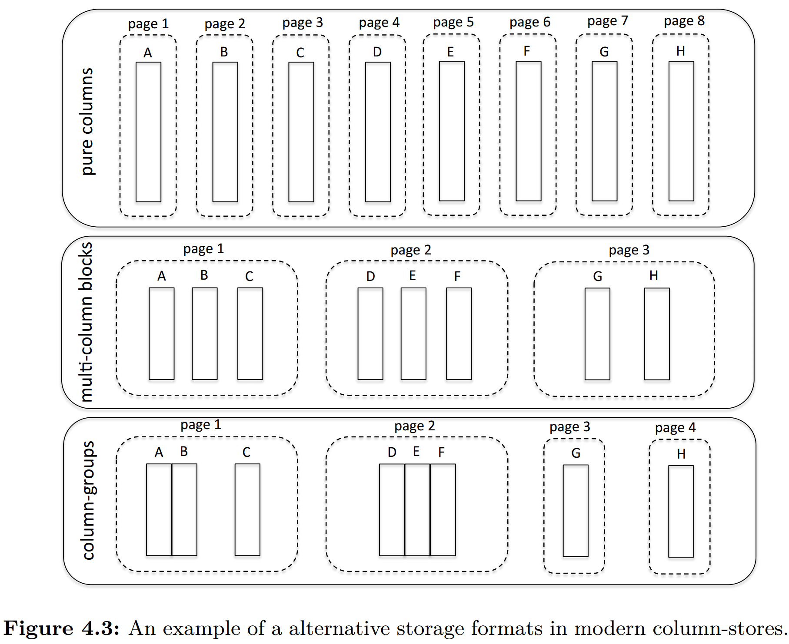

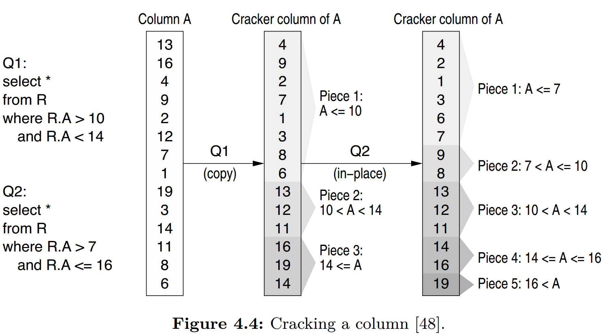

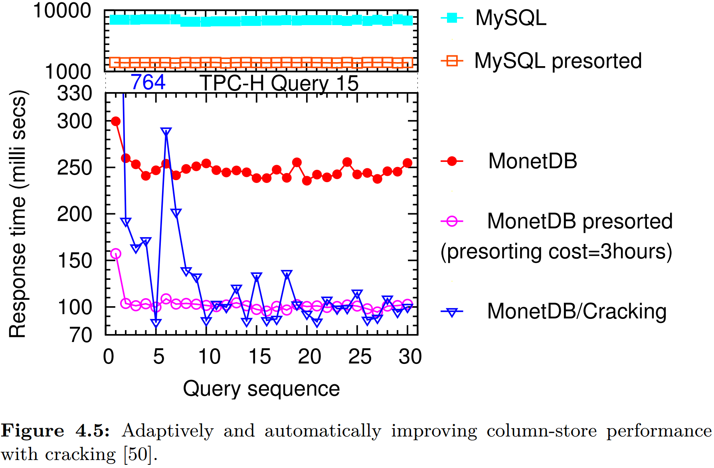

&nbsp;   

## 5 Discussion, Conclusions, and Future Directions

### 5.1 Comparing MonetDB/VectorWise/C-Store

### 5.2 Simulating Column/Row Stores

### 5.3 Conclusions

