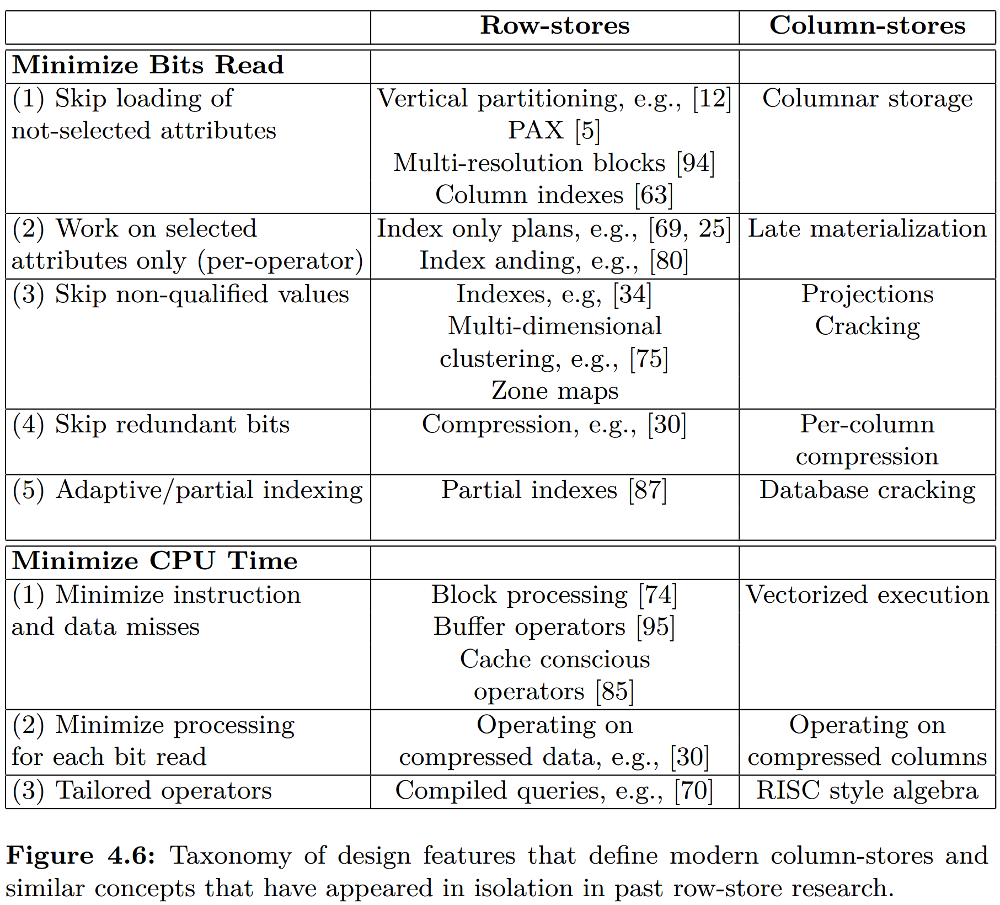

# [The Design and Implementation of Modern Column-Oriented Database Systems](https://dl.acm.org/doi/10.5555/2602024) 笔记

- [1 Introduction](#1)
- [2 History, trends, and performance tradeoffs](#2)
- [3 Column-store Architectures](#3)
- [4 Column-store internals and advanced techniques](#4)
- [5 Discussion, Conclusions, and Future Directions](#5)

&nbsp;   

## 1 Introduction

- [The design and implementation of modern column-oriented database systems - the morning paper](https://blog.acolyer.org/2018/09/26/the-design-and-implementation-of-modern-column-oriented-database-systems/)

- offset 寻址 record, fixed-width（考虑 compression）
- block processing, cpu utilization
- late materialization, memory bandwidth
- compression
- 直接在 compressed data 上做计算
- join
- sorted column
- I/O pattern: write optimized memory buffer -> batched  flush compressed column

&nbsp;   

## 2 History, trends, and performance tradeoffs

### 2.1 History

### 2.2 Technology and Application Trends

- disk 演进（capacity, transfer, seek time）导致 memory access pattern 变化
- cpu frequency 快于 memory access
- 实践
  - MonetDB
  - PAX: NSM page is organized as columns
  - Fractured Mirrors: both NSM and DSM
  - SybaseIQ
  - C-Store / VectorWise

### 2.3 Fundamental Performance Tradeo!s

DSM storage model against scan workload

- projectivity
- SSD：缓解 random read
- low selectivity：reconstruct 少读了很多，NSM 还是要读每个 tuple

&nbsp;   

## 3 Column-store Architectures

### 3.1 C-Store

- 以 column 为单位组织文件，compress，sort
- ROS: read optimized store
- WOS: write optimized store
- **projection**：在某一组 column 上进行 sort 的一个 column group
  - 意味着 column storage 会有冗余
  - 按 column 一级一级 sort
  - 不同形式的 projection 处理不同形式的 query
- compression method
  - sorted
  - data type
  - distinct value 的数量
- sparse index
  - 类似 btr，引入 internal node，加速二分
  - 也可以对 tuple id 进行 sparse index，当 compressed 或 variable-size attr
- update = delete mark + insert
- late materialization
- join
- batch processing
- MPP

### 3.2 MonetDB and VectorWise

#### MonetDB

- 列存计算
- 更加看重 cache miss，而不是 IO cost
- index
- optimization
- 尝试消除 interpretation 开销

#### VectorWise

- vectorized execution
- block of a column at a time
- I/O
- TP: Positial Delta Tree
- compression

### 3.3 Other Implementations

- Column Storage Only：仍使用 NSM execution engine，易于从原有架构演进
- Native Column Store Design：将一套 column store engine 集成到原有架构
- IBM BLU/BLINK
- Microsoft SQL Servere Column Indexes

&nbsp;   

## 4 Column-store internals and advanced techniques

### 4.1 Vectorized Processing

### 4.2 Compression

### 4.3 Operating Directly on Compressed Data

### 4.4 Late Materialization

### 4.5 Joins

### 4.6 Group-by, Aggregation and Arithmetic Operations

### 4.7 Inserts/updates/deletes

### 4.8 Indexing, Adaptive Indexing and Database Cracking

### 4.9 Summary and Design Principles Taxonomy

&nbsp;   

## 5 Discussion, Conclusions, and Future Directions

### 5.1 Comparing MonetDB/VectorWise/C-Store

### 5.2 Simulating Column/Row Stores

### 5.3 Conclusions

