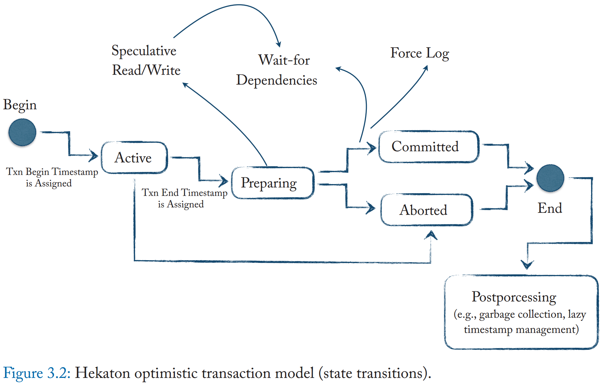
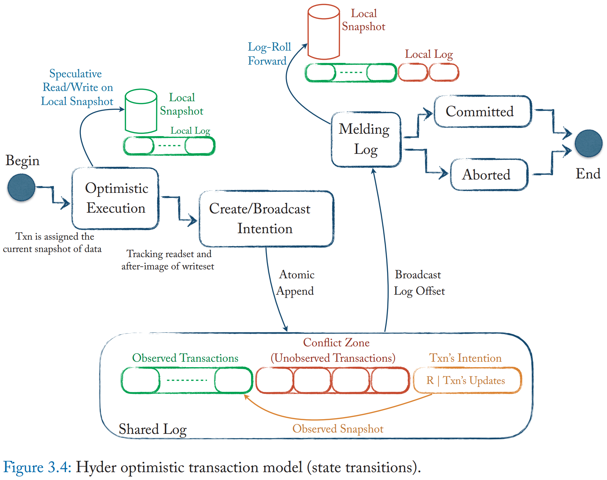
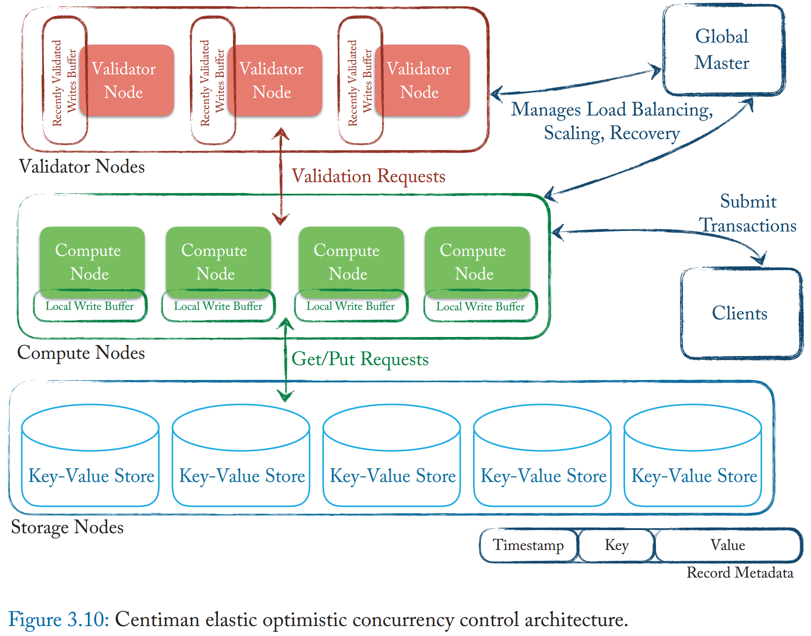
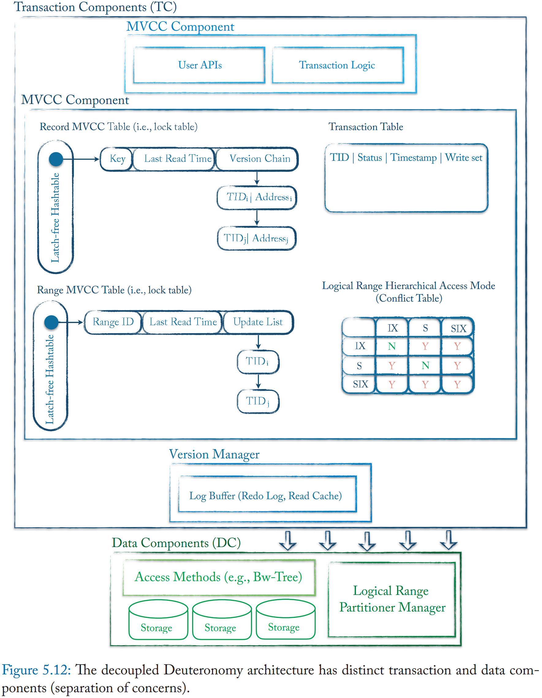

# Transaction Processing on Modern Hardware 读书笔记

> 第一遍先粗看，之后需要详细过一遍，各种 reference 还有各种方案架构和实现细节的讨论。 - 2020.06   

- [1 Introduction](#1)
- [2 Transaction Concepts](#2)
- [3 Multi-Version Concurrency Revisited](#3)
- [4 Coordination-Avoidance Concurrency](#4)
- [5 Novel Transactional System Architectures](#5)
- [6 Hardware-Assisted Transactional Utilities](#6)
- [7 Transactions on Heterogeneous Hardware](#7)
- [8 Outlook: The Era of Hardware Specialization and Beyond](#8)

&nbsp;   

## 1 Introduction

- hardware trend
  - memory
  - multi-core
- TP 可以完全放进 memory
- 小数据库可以常驻 cache
  - cache-resident
  - branch misprediction
  - vectorization
- instruction 有效利用率，去除冗余
  - memory-resident 可以去除 buffer pool
- 利用 multi-core
  - 针对不同场景如 NUMA 进行设计

&nbsp;   

## 2 Transaction Concepts

### ACID

- atomicity
- consistency
- isolation
  - dirty write
  - dirty read
  - non-repeatable read: write from read, anti-dependency
  - phantom: update/delete on predicated range
  - lost update
  - read skew: observe partial writes
  - write skew: implicit constraint
- durability
  - undo log: reverse aborted trxn
  - redo log: reapply committed trxn

### Overview Concurrency Control Protocol

- pessimistic: validate read before reading
  - 2PL (fine-grained locking)
  - Partition Locking (coarse-grained locking)
- optimistic: validate read before committing
  - write visibility
  - maintain private work space, read sets, write sets

&nbsp;   

## 3 Multi-Version Concurrency Revisited

### 3.1 Optimistic Concurency

- abort, retry 开销逐渐减小
- 数据常驻内存导致 disk I/O 不再位于关键路径

#### 3.1.1 Hekaton

- Hekaton 中的潜在 [**bug**](https://github.com/rsy56640/paper-reading/tree/master/%E6%95%B0%E6%8D%AE%E5%BA%93/content/High-Performance%20Concurrency%20Control%20Mechanisms%20for%20Main-Memory%20Databases)：获取 commit-ts 和对外展示并非原子，解决方案：
  - 业务不感知 ts，并且操作只有 point kv
  - 使用 **Hardware Transactional Memory**
  - 在每个 version chain 开头加入 commit-tag，将中心化的查找 txn state 的操作分散到数据上

#### 3.1.2 Hyder

#### 3.1.3 2VCC: Two-Version Concurrency Control

> 这里面细节太多了，不看原论文恐怕理解不到位。   

- indirection layer：中心化映射服务，LID -> RID
- RID：physical location of lateset record
  - 可变的
- LID：映射到 RID
  - 固定的
- version chain 是 new2old，LID + extra lookup => latest version of the record
- 感觉有点莫名其妙的
  - 为什么不把“LID->RID”放到 index kv 的 value 上，而要搞一个中心化服务
  - 什么叫做“reduces the cost of maintaining indexes”
  - index 和 indirection layer 之间的一致性或并发问题

- delta 的各种实现策略

- cRID：committed RID
  - 读操作走这里
- uRID：uncommitted RID
  - 写操作独占
- 写事务 commit 时
  - 更新 cRID 为 uRID
  - 重置 uRID 为 nullptr
- 问题：读操作可能在写事务提交与 install commit 之间进来，读到旧数据？

- certifying phase
  - 读写只拿 shared lock，写操作在 certifing phase 升级为 exclusive lock
- 问题：一个读写事务的读依赖于另一个读写事务的写，如何 speculatively read uRID 来避免 validation failure？
- 写写冲突用 CAS uRID 解决

#### 3.1.4 Centiman: Optimistic Watermarking

- 不需要检查 read set，分布式 validation（没搞懂）

#### 3.1.5 Hyper

- 为了 scan performance，所以 **in-place update** + **undo buffer chain**
- precision locking: predicated range lock

#### 3.1.6 ERMIA

#### 3.1.7 Cicada

#### 3.1.8 Speculative Multi-Partition Transactions

#### 3.1.9 BCC: Blanced Concurrency Control

- [What Write Skew Looks Like - Cockroach Labs](https://www.cockroachlabs.com/blog/what-write-skew-looks-like/)
- [BCC: Reducing False Aborts in Optimistic Concurrency Control with Low Cost for In-Memory Databases](https://web.cse.ohio-state.edu/~blanas.2/files/vldb2016_bcc.pdf)
- [Concurrency Protocol Aiming at High Performance of Execution and Replay for Smart Contracts](https://arxiv.org/pdf/1905.07169.pdf)
- [Improving Optimistic Concurrency Control Through Transaction Batching and Operation Reordering](https://www.microsoft.com/en-us/research/uploads/prod/2018/11/occ_batch_reorder_vldb2018.pdf)

### 3.2 Pessimistic Concurrency Control

#### 3.2.1 SLI: Speculative Lock Inheritence

- lock 传递不经过 lock manager，直接由 txn 传到 txn，适用于 hierarchical lock

#### 3.2.2 ORTHRUS

- 将 TP 流水线化，不同模块由不同线程负责执行
- 确定性并发控制，类似 Calvin，假设 read/write set 提前确定

#### 3.2.3 VLL: Very Lightweight Locking

- 去中心化 lock manager，将 lock 做到 row-level meta 上

- 确定性并发控制

### 3.3 Time-Based Concurrency

#### Tictoc

- 没搞懂是如何减少 abort？（Tj 写了 Ti 的读，所以 Tj 延迟？）

#### PSI: Posterior Snapshot Isolation

- 感觉“rw”和“wr”写反了，参考 [What Write Skew Looks Like](https://www.cockroachlabs.com/blog/what-write-skew-looks-like/)
- 为了减少 anti-dependency 来修改 commit 时机，需要看原论文研究更多细节

#### Range Conflict Management

- rj 和 wk 产生 anti-dependency，所以将 Tk 延后
- 注意到后面的 wj 与 rk 仍有 anti-dependency。不妨假设 ts(Tk) > ts(Tj)，那么 rk 就会选择等待，或者在 Hekaton 基础上引入 Hardware Transactional Memory

#### SSN: Serial Safety Net

### 3.4 Multi-Version Storage Model

#### LSA: Lineage-Based Storage Architecture

- 存 base 和 delta，GC 定期合并

&nbsp;   

## 4 Coordination-Avoidance Concurrency

转向 deterministic 若非 non-deterministic

### 4.1 Restrictive Concurrency

#### 4.1.1 H-Store

> 几篇参考论文待看   

- multi-partition transaction
  - speculative execution
  - lightweight locking

#### 4.1.2 Calvin

- sequencer 负责串行化 transaction
- 提前确定 read/write sets
- deterministic 2PL

#### 4.1.3 LADS

- intra-graph dependency 怎么处理

### 4.2 Deterministic Planning Optimization

#### 4.2.1 Lazy Evaluation

- now phase
  - 写 log（逻辑？）
  - 分析 dependency
  - write stickification（其他 txn 怎么知道？）
- later phase
  - substantiation（是否需要 bypass 到其他 txn？）

#### 4.2.2 Early Write Visibility

#### 4.2.3 BOHM

- 有点像 ROB + OoOE

&nbsp;   

## 5 Novel Transactional System Architectures

### 5.1 Hardware-Aware Concurrency

#### 5.1.1 DORA: Data-Oriented Architecture

- 线程专用化，TP stage 流水线化
- 依赖分析

#### 5.1.2 Silo

- epoch 批处理
- 每个 epoch 保证 **total write order per record** 而不是 total order per txn

- concurrency protocol
  - read phase
  - validation phase
      - 根据**预先决定好的顺序** lock write set（可能 abort？）
      - 获取 global epoch counter
      - 检查 read set（可能 abort？）
  - write commit phase
- **record-level redo logging**
- rw-anti-dependency
  - **partial epoch commit & recovery**（*有点意思*）

#### 5.1.3 FOEDUS: Fast Optimistic Engine for Data Unification Services

- dual-page：DRAM 做 TP，NVRAM 存稳定 snapshot
  - 周期性地 apply log 到 NVRAM
  - 舍弃 DRAM page pointer，需要显式设立 txn barrier
- stratified SI

#### 5.1.4 MOCC: Mostly Optimistic Concurrency

这smjb。。。

#### 5.1.5 ACC: Adaptive Concurrency Control

- cross-partition txn
- 每个 partition 根据 workload 选择 concurrency protocol
- 如何管理混合 concurrency protocol
- 如何在保证 txn 语义的前提下进行 concurrency protocol 转变
  - 2VCC

#### 5.1.6 QueCC: Queue-Oriented, Control-Free Concurrency

- planning：将 batch txns 变为 serial order of read/write operations
- execution：priority？

### 5.2 HTAP: Hybrid Transactional and Analytical Processing

- data representation
  - row
  - column
  - hybrid
- data copy
  - single replica
  - multiple replica

#### 5.2.1 L-Store: Lineage-Based Data Store

#### 5.2.2 ExpoDB: Exploratory Data Platform

> 这些玩意为什么能拆开，搞成服务化的东西，什么鬼？

#### 5.2.3 BatchDB

#### 5.2.4 Deuteronomy: Decomposed Transaction Model

&nbsp;   

## 6 Hardware-Assisted Transactional Utilities

### 6.1 Database Partitioning

#### 6.1.1 Schism

- offline partition: priori knowledge 固定访问模式
- 最小割

#### 6.1.2 Zephyr

#### 6.1.3 Squall

#### 6.1.4 E-Store

#### 6.1.5 Clay

### 6.2 Database Indexing

#### 6.2.1 Hash Tables

- lock-free access
- lock-free memory allocation
- lock-free memory reclamation

#### 6.2.2 Bw-Tree

#### 6.2.3 MassTree

#### 6.2.4 ART: Adaptive Radix Tree

#### 6.2.5 BzTree

&nbsp;   

## 7 Transactions on Heterogeneous Hardware

&nbsp;   

## 8 Outlook: The Era of Hardware Specialization and Beyond

